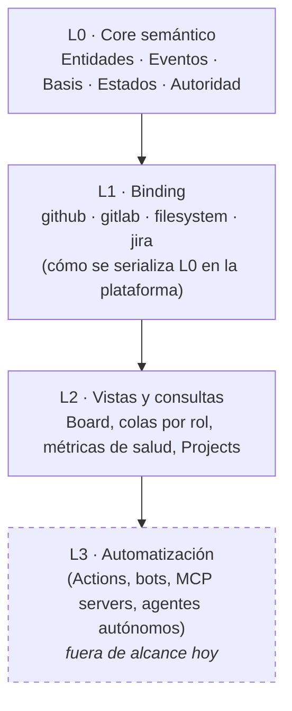
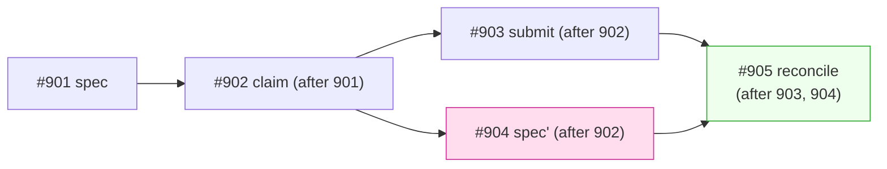
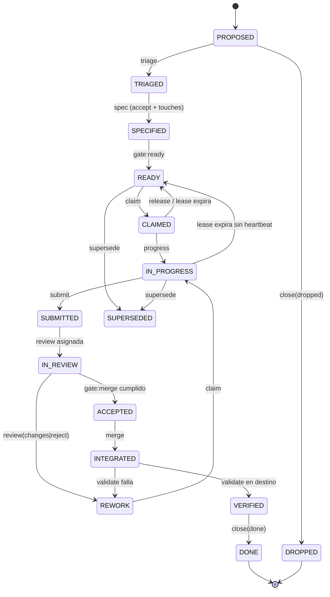
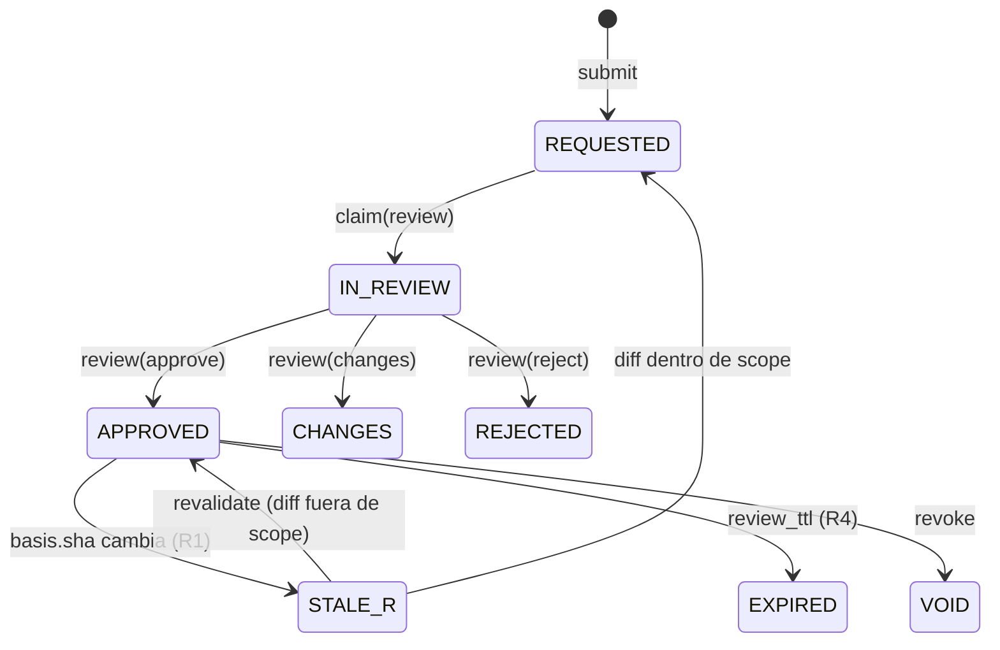

# ACP/1.1 — Agent Coordination Protocol

> ### Estado: **candidata a enmienda normativa (ACP-1.1)**
>
> Este documento es ACP-1 revisado para incorporar veintitrés enmiendas (**A1–A23**) surgidas de implementar el schema ejecutable y de las revisiones de arquitectura. **No está aprobado.** La resolución razonada de cada enmienda —con `ACCEPT` / `MODIFY` / `REJECT` / `DEFER`— está en [`decisions/ACP-1.1-amendments.md`](decisions/ACP-1.1-amendments.md); los cambios visibles, en [`CHANGELOG.md`](CHANGELOG.md).
>
> **Once enmiendas son breaking.** El schema V2 publicado en `feat/acp-envelope-schema@9d073e3` **no** implementa esta versión: implementa una propuesta anterior con la que ACP-1.1 discrepa en ocho puntos (§0.5). Reconciliarlos exige un schema V3, que **no** forma parte de esta entrega.

**Un protocolo de coordinación para equipos mixtos humano–IA que usan un forge (GitHub) como único source of truth.**

| | |
|---|---|
| Versión | `1.1.0-draft` (candidata) |
| Sustituye a | `1.0.0-draft` en `feat/acp-1-protocol@0b714a9a` |
| Estado | Borrador de diseño **publicado para revisión comparativa**. No implementado, no adoptado |
| Capa semántica | ACP/1 Core (independiente de plataforma) |
| Binding definido aquí | `github` |
| Programa de referencia | `reforapp` (`ReformandoPro/reforapp`) |
| Automatización | **Fuera de alcance por decisión explícita.** Ver §17.4 |

### Contexto de publicación

Este documento se publica en la rama `feat/acp-1-protocol` **junto a**, y no en lugar de, la propuesta paralela `docs/agents/protocol.md` de la rama `chore/agent-protocol-mvp`. Existe además una tercera propuesta en `openclaw/agent-operating-protocol`. Ninguna sustituye a las otras: la decisión de cuál se adopta —o qué se toma de cada una— es objeto de la revisión, no de este documento.

Cuatro cosas que **no** ocurren al publicar esto:

- **Nada se ha creado en GitHub.** Las labels de §14.2, los templates de §14.4, el Project de §14.6 y el plan de §19 son **propuestas**. No se ha creado ninguna label, ningún template, ningún Project ni ninguna cuenta.
- **No hay automatización.** Ni workflows, ni Actions, ni bots, ni webhooks, ni scripts. La capa L3 (§2) está deliberadamente fuera de alcance; §17.4 argumenta por qué el diseño es mejor por haber empezado sin ella.
- **No se toca el trabajo en curso.** ACP no se aplica a R1, R2 ni R2.1 mientras esté en revisión.
- **Los identificadores de producto están reservados.** `R1`, `R2`, `R2.1` son hitos del roadmap existente y **no** son work items ACP. Los work items de este programa usan el prefijo `RF-` sobre el número de issue (§4.2), precisamente para que ambos espacios de nombres no puedan confundirse.

---

## Índice

0. [Alcance, no-objetivos y perfiles de conformidad](#0)
1. [Los siete invariantes](#1)
2. [Arquitectura en capas](#2)
3. [Ontología: las entidades](#3)
4. [Identidad y direccionamiento](#4)
5. [El log: eventos y sobre (envelope)](#5)
6. [Basis: el grafo de invalidación](#6)
7. [Ciclo de vida y modelo de estados](#7)
8. [Autoridad: roles, capacidades y gates](#8)
9. [Protocolo de comunicación: quién escribe qué, quién lee qué](#9)
10. [Concurrencia: leases, superficie de escritura y conflictos](#10)
11. [Recuperación: cold start, resume packet, checkpoints](#11)
12. [Ramas, PRs, artifacts y su enlazado](#12)
13. [Los seis registros: decisiones, riesgos, deuda, bloqueos, autorizaciones, evidencias](#13)
14. [Binding GitHub: mapeo concreto](#14)
15. [Auditoría, violaciones y reconciliación](#15)
16. [Versionado, compatibilidad y tiempo](#16)
17. [Autocrítica: tres iteraciones y qué rompí](#17)
18. [Debilidades que siguen abiertas](#18)
19. [Adopción: de cero a ACP-2 en una semana](#19)
20. [Apéndice A: ejemplo completo de un work item](#20)
21. [Apéndice B: gramática del envelope](#21)

---

<a name="0"></a>
## 0. Alcance, no-objetivos y perfiles de conformidad

### 0.1 El problema que resuelve

Varios agentes (LLM) y varios humanos trabajan sobre el mismo repositorio durante semanas. Cada agente tiene:

- **contexto volátil** (se pierde al terminar la sesión),
- **contexto acotado** (no puede leer 40 issues),
- **capacidad de alucinar** (puede afirmar cosas que no verificó),
- **no hay canal directo** con los demás agentes.

Hoy el humano hace de bus de mensajes: copia y pega. Eso tiene coste O(n²) en pares de agentes y O(mensajes) en atención humana. No escala.

ACP convierte el forge en **memoria compartida verificable**: un log append-only de hechos, más proyecciones derivadas y cacheables, más un grafo de dependencias que invalida automáticamente lo que ha quedado obsoleto.

### 0.2 No-objetivos

| No-objetivo | Por qué |
|---|---|
| Ejecutar código, tests o deploys | ACP describe y verifica trabajo; no lo hace |
| Sustituir a Git | Git es la verdad del código. ACP es la verdad **sobre** el código |
| Chat en tiempo real | La latencia mínima aceptable es "un turno de agente", no un segundo |
| Automatización (Actions/bots/webhooks) | Decisión explícita del PO. §17.4 explica por qué el diseño es *mejor* por haber empezado sin ella |
| Seguridad criptográfica fuerte | ACP es **tamper-evidente**, no tamper-proof. §18.3 |

### 0.3 Perfiles de conformidad

Un estándar que solo funciona completo no se adopta. ACP define cuatro niveles acumulativos. **Un equipo puede vivir indefinidamente en cualquiera de ellos.**

| Perfil | Qué exige | Coste humano | Qué te compra |
|---|---|---|---|
| **ACP-0 · Naming** | Nomenclatura de ramas, PRs, issues y labels. Un `AGENTS.md`. | ~1 hora una vez | Trazabilidad básica; nadie se pierde |
| **ACP-1 · Log** | Todo hecho relevante es un evento con envelope. Issue body = proyección. | ~20 s por evento | Recuperación de sesión; auditoría |
| **ACP-2 · Basis** | `basis` obligatorio; invalidación por SHA; leases; `touches`. | +10 s por evento | Detección de obsoleto y de conflicto **antes** del merge |
| **ACP-3 · Governance** | Gates, autorizaciones con caducidad, quorum de revisión, reconciliación periódica. | +1 pasada/semana | Coordinación sin humano en el bucle |

> **Recomendación para el equipo actual (5 agentes, 1 programa): empezar en ACP-1, subir a ACP-2 en la segunda semana, ACP-3 solo cuando haya >10 items simultáneos.** Ver §19.

---

### 0.5 Discrepancias abiertas con el schema V2

El schema ejecutable de `feat/acp-envelope-schema@9d073e3c` se escribió **antes** que esta revisión. ACP-1.1 se aparta de él en ocho puntos, todos deliberados y argumentados en el fichero de decisiones. Se listan aquí para que nadie asuma conformidad:

| # | Schema V2 | ACP-1.1 | Enmienda |
|---|---|---|---|
| 1 | `v` entero `1` | cadena `"1.1"` (mayor.menor) | A20 |
| 2 | `after` acepta entero pelado | solo forma namespaced `binding-clase:id` | A21 |
| 3 | extensiones `x-*` en la raíz | contenedor único `extensions` | A14-mod |
| 4 | `item` opcional en 6 tipos | exactamente uno de `item` o `program` | A17 |
| 5 | raíz permitida en 6 tipos | solo `spec`, `reconcile`, `decide` de programa | A11-mod |
| 6 | `unverified` con `minItems: 1` | `[]` admisible como «ninguna declarada» | A19 |
| 7 | `heartbeat`/`release` sin referencia al claim | ambos exigen `claim` | A18 |
| 8 | sin `on_behalf_of` | delegación explícita | A22 |

**Hasta que exista un schema V3, ningún fixture de V2 debe tomarse como prueba de conformidad con ACP-1.1.**

---

<a name="1"></a>
## 1. Los siete invariantes

Todo lo demás en este documento es consecuencia de estos siete. Si un cambio futuro rompe uno, el cambio está mal.

### I1 — El log es la verdad; todo lo demás es caché

Los comentarios de un issue forman un **log append-only**. El cuerpo del issue, las labels, los Projects y los tableros son **proyecciones derivadas**. Si proyección y log discrepan, gana el log, y la discrepancia es un defecto reportable (`violation:drift`).

*Consecuencia:* nunca hay que "arreglar el estado". Se re-proyecta.

### I2 — Ninguna afirmación sobre el código existe sin un ancla de contenido

Toda afirmación (revisión, validación, aprobación, evidencia, estimación) declara su **basis**: el conjunto de `(repo, ref, sha)` y versiones de entidades de las que depende. Sin basis, la afirmación es **inadmisible**: no cuenta para ningún gate.

*Consecuencia:* "obsoleto" es computable, no una opinión.

### I3 — Un solo escritor por campo

Cada sección de cada proyección tiene exactamente un rol propietario. Dos agentes nunca escriben el mismo campo.

*Consecuencia:* desaparece la clase entera de bugs "lost update" al editar cuerpos de issue en paralelo.

### I4 — El tiempo y la identidad los asigna la plataforma, no el agente

Los agentes **no** generan IDs de evento ni timestamps. Usan los que asigna GitHub (`comment.id`, `created_at`). Las duraciones (leases, caducidades) se expresan en **relativo** ("6h") y se resuelven contra el timestamp de plataforma.

*Consecuencia:* se elimina la dependencia del reloj y del contador de un LLM, que son poco fiables.

### I5 — La ignorancia se declara explícitamente

Todo evento que afirme algo sobre el trabajo lleva un campo `unverified:` con lo que el autor **no** comprobó. Un `submit` o `review` sin `unverified` es no conforme.

*Consecuencia:* el silencio deja de significar "está bien". El hueco es visible y auditable.

### I6 — Toda pregunta al humano lleva un default y una caducidad

Un evento `question` **debe** declarar `default_if_silent` y `expires`. Al vencer, el default se aplica como `assume` y el trabajo continúa, registrando el riesgo.

*Consecuencia:* el humano deja de ser un punto de bloqueo síncrono. Su ausencia tiene semántica definida.

### I7 — Arranque en frío acotado

Cualquier agente debe poder reconstruir el contexto operativo completo de un work item leyendo **una cantidad acotada y constante** de material: `AGENTS.md` → `acp.yml` → proyección del item → último checkpoint → eventos posteriores. Nunca "lee todo el historial".

*Consecuencia:* la recuperación tras perder el contexto es una operación O(1), no O(historia).

---

<a name="2"></a>
## 2. Arquitectura en capas

La razón por la que esto puede aspirar a ser estándar y no "cómo trabajamos nosotros" es la separación estricta entre semántica y binding. HTTP no es TCP. ACP no es GitHub.



| Capa | Contenido | Sustituible |
|---|---|---|
| **L0 Core** | Ontología, tipos de evento, reglas de invalidación, máquina de estados, modelo de autoridad. Cero menciones a GitHub. | No. Es el estándar. |
| **L1 Binding** | Cómo se materializa L0: qué es un issue, qué es un label, dónde vive el log. Este documento define el binding `github`. | Sí. Un binding `filesystem` (ficheros en el repo) o `gitlab` son ejercicios mecánicos. |
| **L2 Vistas** | Todo derivado y regenerable. Un tablero, una cola de revisión, un informe. **Nunca fuente de verdad.** | Sí, libremente. |
| **L3 Automatización** | Ejecutores del protocolo. Un bot que valida envelopes, un Action que recalcula labels. | Sí. Y crucialmente: **añadir L3 no cambia L0.** |

**Propiedad clave:** el protocolo se ejecuta a mano en L0+L1. La automatización de L3 solo elimina esfuerzo, nunca añade capacidad. Eso significa que un equipo puede adoptar ACP hoy y automatizarlo por partes sin migración.

---

<a name="3"></a>
## 3. Ontología: las entidades

Diecisiete entidades. Cada una tiene identidad estable, ciclo de vida y un rol propietario.

### 3.1 Tabla maestra

| # | Entidad | Qué es | Inmutable | Propietario | Binding GitHub |
|---|---|---|---|---|---|
| E1 | **WorkItem** | Unidad de trabajo delegable con criterio de aceptación verificable | No (proyección) | Coordinador (spec) / Ejecutor (progreso) | Issue |
| E2 | **Initiative** | Agrupación con resultado de negocio; contiene WorkItems | No | Product Owner | Issue padre + Milestone |
| E3 | **Event** | Hecho ocurrido. Ladrillo atómico del log | **Sí** | Su emisor | Issue comment |
| E4 | **Basis** | Ancla de contenido: `(repo, ref, sha)` + versiones de entidades | **Sí** | — (dato) | Campo del envelope |
| E5 | **Claim / Lease** | Reserva temporal exclusiva de un WorkItem por un agente | **Sí** (se libera con otro evento) | Ejecutor | Event `claim` + label |
| E6 | **Submission** | Entrega de trabajo: qué se hizo, sobre qué basis, qué no se verificó | **Sí** | Ejecutor | Event `submit` + PR |
| E7 | **Review** | Juicio experto con veredicto, ligado a un basis. Caduca | **Sí** | Revisor | PR review + Event `review` |
| E8 | **Validation** | Comprobación mecánica y reproducible de una propiedad | **Sí** | Cualquiera con shell | Event `validate` + Evidence |
| E9 | **Evidence** | Observación reproducible: comando, entorno, salida, digest | **Sí** | Su productor | Artifact / gist / bloque + digest |
| E10 | **Approval** | Consentimiento de un rol autorizado para cruzar un gate. Caduca y se invalida | **Sí** | Rol con capacidad | Event `approve` |
| E11 | **Authorization** | Permiso previo para una acción de efecto externo (deploy, gasto, borrado) | **Sí** | Product Owner | Event `authorize` |
| E12 | **Decision** | Elección técnica con alternativas, consecuencias y ámbito. Versionada, no editada | **Sí** por versión | Coordinador + PO | Fichero `decisions/` + Issue de deliberación |
| E13 | **Risk** | Evento futuro posible con impacto, probabilidad, disparador y dueño | No | Su dueño | Issue en registro + label |
| E14 | **Debt** | Compromiso consciente con coste recurrente y condición de pago | No | Coordinador | Issue en registro + label |
| E15 | **Blocker** | Relación: X no puede avanzar hasta que Y. Con condición de desbloqueo | No | Quien lo declara | Event `block` + label + relación |
| E16 | **Assumption** | Premisa no verificada sobre la que se está construyendo | No | Quien la asume | Event `assume` |
| E17 | **Checkpoint** | Resumen autoritativo que hace innecesario leer lo anterior | **Sí** | Coordinador | Comment `checkpoint` |

Entidades auxiliares (no de primer orden, pero definidas): **Question** (§13.6), **Handoff** (§11.4), **Violation** (§15), **ResumePacket** (§11.2), **Program** (§4.3), **Gate** (§8.4).

### 3.2 Notas de diseño sobre entidades concretas

**WorkItem — el criterio de aceptación es obligatorio y verificable.**
Un WorkItem sin `accept:` no puede pasar de `SPECIFIED`. `accept` no es prosa: es una lista de comprobaciones que otro agente puede ejecutar sin preguntar nada. "Que funcione bien" no es criterio. "`pytest tests/rls -q` sale 0 y `SELECT ... FROM pg_default_acl` devuelve 0 filas" sí.

**Review ≠ Validation.** Es la distinción más útil de toda la ontología y casi nadie la hace:

| | Review | Validation |
|---|---|---|
| Naturaleza | Juicio | Medición |
| ¿Reproducible? | No | Sí, por definición |
| Falla por | Criterio, diseño, riesgo | Hecho observable |
| La invalida | Cambio de basis | Cambio de basis |
| ¿Puede delegarse a L3? | No | **Sí, entera** |

Separarlas define exactamente qué se puede automatizar después: *todas las Validations, ninguna Review*. Esa frontera es la hoja de ruta de automatización, gratis.

**Evidence — sin digest no es evidencia.** Una Evidence es la tupla `(cmd, env, basis, output_digest, location)`. Pegar la salida de un comando en un comentario es una *alegación*, no una evidencia: nadie puede distinguirla de una alucinación. Con digest y comando, cualquiera la reproduce. Esta es la defensa estructural contra el agente que "cree" que los tests pasan.

**Decision — se versiona, no se edita.** Una decisión vive como fichero en el repo (`decisions/ACD-0007-rls-grants.md`), lo que la hace diffable, revisable por PR y anclable por SHA. El issue asociado es la *deliberación*, no la decisión. Cambiar de opinión = nueva versión con `supersedes: ACD-0007`. Nunca se reescribe la historia de por qué se hizo algo.

**Assumption — la entidad que falta en todos los sistemas de tickets.** Los agentes construyen sobre premisas todo el tiempo y las entierran en su razonamiento. Al hacerla entidad de primer orden con dueño y condición de verificación, cada suposición se convierte en un riesgo rastreable en lugar de una bomba silenciosa. Y §13.6 la conecta con las preguntas caducadas: si el humano no responde, la pregunta se convierte automáticamente en `assume` + `risk`.

---

<a name="4"></a>
## 4. Identidad y direccionamiento

### 4.1 URN de ACP

Todo es direccionable con una cadena estable:

```
acp:<program>/<kind>/<id>[@<version>]
```

| Ejemplo | Significa |
|---|---|
| `acp:reforapp/item/RF-142` | WorkItem RF-142 |
| `acp:reforapp/item/RF-142@github-comment:2451889301` | Estado de RF-142 tal como estaba tras el evento github-comment:2451889301 |
| `acp:reforapp/decision/ACD-0007@2` | Versión 2 de la decisión ACD-0007 |
| `acp:reforapp/event/github-comment:2451889301` | Un evento concreto |
| `acp:reforapp/evidence/sha256:9f2a...` | Una evidencia por contenido |
| `acp:reforapp/risk/RSK-014` | Un riesgo |

Regla: **una URN nunca se reutiliza ni se recicla.** Los items cancelados no liberan su ID.

### 4.2 Prefijos de ID por tipo

| Tipo | Prefijo | Asignador |
|---|---|---|
| WorkItem | token opaco del perfil; en Reformando `<PROG>-<n>` = `RF-142` | Número de issue de la plataforma. Cero ambigüedad, cero contadores propios |
| Initiative | `<PROG>-I<n>` | Número de issue padre |
| Decision | `ACD-<nnnn>` | Siguiente libre en `decisions/` (colisión detectable en el PR) |
| Risk | `RSK-<nnn>` | Número de issue en el registro |
| Debt | `DEBT-<nnn>` | Número de issue en el registro |
| Event | entero | **GitHub** (`comment.id`) |
| Evidence | `sha256:<hex>` | Contenido |

Nadie inventa identificadores secuenciales de memoria (invariante **I4**). Los LLM son malos contadores; GitHub es bueno.

**Norma ACP-1.1 (A12): la política de identificadores no vive en Core.**

**Core** exige únicamente que un identificador de work item sea un token **estable, portable y opaco**: no vacío, de 1 a 64 caracteres imprimibles ASCII, sin espacios ni caracteres de control, y que **nunca se reutiliza**. Core no impone prefijo, ni forma, ni longitud mínima significativa. Un identificador es una etiqueta, no una descripción.

**El perfil** posee toda la política y **debe** declararla: `ids.work_item_prefix`, `ids.work_item_pattern` (expresión regular), `ids.reserved`, y los prefijos de decisión, riesgo y deuda.

`RF-<n>` es del **perfil Reformando**, no del protocolo. Ningún documento Core menciona `RF-`.

**Identificadores históricos reservados.** `R1`, `R2` y `R2.1` son nombres del **roadmap de producto**, anteriores a ACP y ajenos a él. No son work items ACP, no son direccionables como `acp:…/item/…` y no pueden aparecer como `item:` de ningún evento. Se declaran en `ids.reserved` del perfil.

**Coste que hay que aceptar y no disimular:** al sacar el patrón de Core, **el formato por sí solo ya no puede rechazar `R2.1` como `item`**. Esa comprobación pasa a ser una segunda pasada contra el perfil activo. Es el precio de no meter la nomenclatura de una organización dentro de un protocolo universal, y es el precio correcto; pero es un cheque que antes cobraba el validador y ahora cobra el perfil, y si nadie construye esa pasada, nadie lo cobra.

### 4.3 Program

Un **Program** es la unidad de gobierno: un conjunto de agentes, roles, gates y repos que comparten un log. Se materializa como **un repositorio de coordinación**, aunque el código viva en otros.

- 1 program ↔ 1 repo de coordinación ↔ 1 `acp.yml`.
- Los repos de código llevan un `acp.yml` mínimo que apunta al program (`program: org/coord-repo`).
- **Un WorkItem pertenece a exactamente un program**, aunque toque N repos.

Esto evita el split-brain: si dos repos pudieran hospedar work items del mismo esfuerzo, no habría lugar único para preguntar "¿qué está en vuelo?".

### 4.4 `acp.yml` — la configuración del programa

Machine-readable, versionado, revisable por PR. Es lo que un agente lee inmediatamente después de `AGENTS.md`.

> **El fichero normativo es [`acp.yml`](acp.yml)**, publicado junto a esta spec. Lo que sigue es un **extracto ilustrativo** que muestra la forma de las secciones principales; si difiere del fichero real, gana el fichero real. Esta separación es deliberada: la spec describe la gramática, el fichero declara la configuración de *este* programa, y solo el segundo cambia cuando cambia el equipo.

```yaml
acp: 1                          # versión del protocolo
spec: "1.0.0-draft"             # versión de este documento
program: reforapp
status: proposed
profile: ACP-1                  # perfil de conformidad activo (§0.3)

repos:
  coordination: ReformandoPro/reforapp
  code: [ReformandoPro/reforapp]

ids:                            # §4.2
  work_item_prefix: "RF"
  reserved: ["R1", "R2", "R2.1"]     # hitos de producto: no son work items

agents:                         # una cuenta GitHub distinta por agente (§18.2)
  - {id: jorge,    kind: human, role: product-owner, handle: "@TODO-po"}
  - {id: chatgpt,  kind: llm,   role: coordinator,   handle: "@TODO-coordinator"}
  - {id: openclaw, kind: llm,   role: lead-engineer, handle: "@TODO-lead"}
  - {id: claude,   kind: llm,   role: engineer,      handle: "@TODO-engineer"}
  - {id: hermes,   kind: llm,   role: reviewer,      handle: "@TODO-reviewer", adversarial: true}

roles:                          # qué eventos puede emitir cada rol (§8.1)
  engineer:
    capabilities: ["claim", "heartbeat", "progress", "submit", "validate", "question", "assume", "handoff"]
  # … resto de roles en el fichero real

permissions:                    # qué puede hacer en el mundo. Default deny (§13.5)
  default: deny
  merge_main: authorization
  deploy_production: authorization
  force_push: forbidden

gates:                          # §8.4
  merge:
    requires:
      - review: {verdict: "approve", by_role: "reviewer", count: 1, fresh: true}
      - review: {verdict: "!reject", by_capability: "veto", all: true}
      - validation: ["tests", "lint", "types"]
      - blockers: none
      - unverified_ack: true      # alguien con autoridad firmó los huecos declarados
      - self_approval: forbidden

lease:                          # §10.1
  default: 6h
  max: 48h
  heartbeat: 24h
  on_expiry: return_to_ready

invalidation:                   # §6.2 — política, no estado
  review_ttl: 7d                # R4: una review caduca aunque no cambie el SHA
  approval_ttl: 3d
  drift_max_commits: 50         # R2: divergencia con la base ⇒ stale
  drift_max_days: 10
  revalidate_allowed: true      # §6.3

silence:                        # §13.6
  require_default: true
  default_expires: 24h
  on_expiry: apply_default
  never_default: ["authorize", "approve"]
  never_default_actions: ["deploy", "merge", "migrate", "release", "remote-write", "delete-data"]

limits:
  context_budget: {total_tokens: 5000, log_tokens: 2000, resume_tokens: 500}
  scale: {max_active_items_manual: 50}    # §18

automation:
  enabled: false                # §17.4. Nada de workflows, bots, webhooks ni scripts
```

> Nota de nomenclatura: la clave de configuración es **`invalidation`** (la política). `freshness` se reserva para la *dimensión de estado* de una afirmación (§6.4, §7.1). Son cosas distintas y compartir nombre las confundía.

---

<a name="5"></a>
## 5. El log: eventos y sobre (envelope)

### 5.1 Por qué un log de eventos y no un estado editable

Un cuerpo de issue editable pierde información en cada edición: quién cambió qué y por qué. Un log no pierde nada. Con log, "recuperar contexto" = leer; sin log, = adivinar. Y como el log es append-only, **dos agentes nunca colisionan al escribir** (invariante I3 se vuelve trivial en el log; solo hace falta en las proyecciones).

Coste: los logs crecen. Se resuelve con checkpoints (§11.3) y rotación (§11.5), no renunciando al log.

### 5.2 Anatomía del envelope

Cada evento es un comentario con **dos partes**: un bloque de máquina y prosa humana. La regla es dura: **si están en conflicto, gana el bloque de máquina**, y la discrepancia es una `violation`.

````markdown
```acp
v: "1.1"
type: submit
item: RF-142
actor: claude
role: engineer
after: "github-comment:2451889301"
basis:
  repo: {system: git, id: "https://github.com/ReformandoPro/reforapp.git"}
  ref: feat/RF-142-rls-grants
  sha: 9011dd3f1c4e2b7a8f0d6c5e4a3b2c1d0e9f8a7b
  base: {ref: main, sha: a71c0e94f1e2d3c4b5a6978869504132abcdef01}
  scope: ["db/migrations/**", "src/security/rls/**"]
  environment: "python3.12 / postgres:16.2"
touches:
  - db/migrations/**
  - src/security/rls/**
evidence:
  - id: sha256:791adeb5e2e173d6cf2bdc532f8f08658c33fc5968c268773e330fca6033fa27
    cmd: "pytest tests/rls -q"
    env: "python3.12 / postgres:16.2"
    result: pass
  - id: sha256:c50979e205a5aef2b1b2b73169c9986d957e8c1cb77f583175f32b84824ff217
    cmd: "psql -f audit/default_acl.sql"
    env: "postgres:16.2"
    result: "0 rows"
unverified:
  - "Comportamiento con >1M filas en policy_check (no probado)"
  - "Rollback de la migración 0042 (no ejecutado)"
delivery: {kind: pull-request, id: 141}
extensions:
  x-github-pr: 141
next: review
```

He movido los grants operativos al bloque idempotente y añadido la comprobación
de `pg_default_acl`. El fallo de CI del PR #140 venía de la imagen de Postgres
de CI (2.39.2 frente a 2.109.1 en prod); lo documento como riesgo RSK-014
porque **no** lo he resuelto aquí, solo aislado.
````

**Por qué YAML dentro de una valla de código:** renderiza limpio en GitHub, se parsea con una línea de código cuando llegue L3, sobrevive al copy-paste humano y no obliga a nadie a escribir JSON a mano. El tag `acp` es el discriminador: un comentario sin bloque ` ```acp ` es **conversación**, no evento, y no tiene efecto en el protocolo. Esa distinción es importante: deja espacio para que los humanos hablen sin ensuciar el log.

#### 5.2.1 Miembros comunes (normativo, ACP-1.1)

| Miembro | Obligatoriedad | Quién lo produce |
|---|---|---|
| `v` | siempre | autor. Cadena `"mayor.menor"` (§16) |
| `type` | siempre | autor |
| `actor` | **siempre** (A10) | autor. Identidad **declarada**, no probada (§8.6) |
| `item` | si el evento es de item | autor |
| `program` | si el evento es de programa | autor |
| `after` | siempre salvo raíz (A11) | **la plataforma** lo asignó; el autor lo *copia* |
| `root` | solo en eventos raíz | autor |
| `role` | opcional | autor |
| `on_behalf_of` | opcional | autor (§8.6) |
| `extensions` | opcional | autor |

**Exactamente uno de `item` o `program`.** Todo evento declara de qué habla. Un evento sin sujeto no se puede encolar, proyectar ni auditar, y hasta ACP-1 permitía que `authorize`, `decide`, `reconcile`, `answer`, `revoke` y `violation` flotaran sin él. Los eventos de programa llevan `program: <id>`; los demás, `item`. Declarar ambos, o ninguno, es `violation:unscoped-event`.

#### 5.2.2 Forma plana: decisión normativa (A23)

ACP-1.1 **adopta la forma plana** y rechaza la forma `metadata + payload`. La comparación completa está en [`decisions/ACP-1.1-amendments.md`](decisions/ACP-1.1-amendments.md) §A23. Resumen de la razón decisiva: el aislamiento de campos por tipo —el argumento principal a favor de `payload`— ya lo consigue la forma plana mediante `unevaluatedProperties` en la implementación, y el formato de cable es YAML escrito a mano, donde cada nivel de indentación es un error esperando ocurrir. **No se afirma que la forma plana produzca menos errores de LLM: no se ha medido**, y el experimento que lo zanjaría está descrito en el fichero de decisiones.

Consecuencia que la forma plana obliga a asumir: **los nombres de campo son un espacio de nombres único y global.** Política de colisión, normativa:

1. Un nombre de campo tiene **un solo significado** en todo el protocolo. `basis` significa lo mismo en `review` que en `submit`.
2. Un tipo de evento nuevo **no puede reutilizar** un nombre existente con otra semántica. Si necesita otro significado, necesita otro nombre.
3. Añadir un campo Core a un tipo existente es un cambio **menor**; añadirlo como obligatorio es **mayor** (§16).
4. Los campos de binding y de programa **nunca** entran en el espacio global: van en `extensions` (§5.2.3).

#### 5.2.3 Extensiones (A14, modificada)

Las extensiones viven en **un único contenedor** `extensions`, no dispersas en la raíz:

```yaml
extensions:
  x-github-pr: 141
  x-reforapp-hito: "B"
```

Normativo:

- **Gramática de clave:** `^x-[a-z0-9][a-z0-9-]*$`. `X-Foo`, `x-`, `x_foo` **no son extensiones** y hacen el evento no conforme.
- **Dónde:** solo en `extensions`, en la raíz del envelope, y en la raíz del perfil. No dentro de objetos normativos anidados.
- **Valor:** cualquier JSON. Obligar a que sea objeto no aporta nada y encarece el caso común (`x-github-pr: 141`).
- **No pueden sustituir campos normativos.** Poner en `extensions` algo que el protocolo ya nombra es `violation:shadowed-field`. Al estar en un contenedor propio, la sustitución es visible en lugar de mimetizarse con la raíz.
- **Lector tolerante:** *debe* preservar `extensions` que no entiende al reescribir o proyectar (§16.2).
- **Escritor estricto:** *debe* validar la gramática antes de publicar.
- **Colisiones:** el segmento inmediatamente posterior a `x-` es el espacio de nombres del propietario (`x-github-…`, `x-reforapp-…`). Dos propietarios distintos no comparten prefijo. No hay registro central; el prefijo es la disciplina.

### 5.3 Catálogo de eventos (normativo y cerrado, ACP-1.1)

**Veintisiete tipos.** El catálogo es **cerrado**: un tipo nuevo requiere una versión mayor de protocolo. Un perfil puede *restringir* qué tipos usa; **no puede añadir tipos** — lo específico de un programa va en `extensions` (§5.2.3). No existen «eventos de Profile».

`answer` · `approve` · `assume` · `authorize` · `block` · `checkpoint` · `claim` · `close` · `debt` · `decide` · `handoff` · `heartbeat` · `progress` · `question` · `reconcile` · `release` · `revalidate` · `review` · `revoke` · `risk` · `spec` · `submit` · `supersede` · `triage` · `unblock` · `validate` · `violation`

Digest del catálogo (lista ordenada, unida por comas, sin espacios):
`sha256:046f7cadad317948c7a92a808bade47bbbdf61bdb467ce26a49891da730e0e91`

**Alias prohibidos.** Usar cualquiera de estos hace el evento no conforme (`violation:alias-type`). Se listan porque todos han aparecido en documentos de trabajo:

| Alias visto | Tipo normativo |
|---|---|
| `decision` | `decide` |
| `validation` | `validate` |
| `approval` | `approve` |
| `authorization` | `authorize` |
| `specify` (como tipo) | `spec` — `specify` era el nombre de la *capacidad*, ver §8.1 |
| `blocked`, `unblocked` | `block`, `unblock` |
| `comment`, `note`, `update`, `status` | ninguno: es conversación, no evento (§5.2) |

**Solapamientos resueltos.** Cuatro pares se confunden con frecuencia; la distinción es normativa:

| Par | Distinción |
|---|---|
| `review` vs `validate` | Juicio experto vs medición reproducible (§3.2). Es la frontera de automatización: toda `validate` es automatizable, ninguna `review` lo es |
| `approve` vs `validate` | `validate` con `check: gate:<x>` **computa** el estado de un gate; `approve` **consiente** cruzarlo. Cálculo frente a autoridad. Un gate satisfecho por cómputo pero sin consentimiento no está cruzado |
| `answer` vs `decide` | `answer` resuelve una pregunta concreta; `decide` publica una decisión con ámbito. **Norma:** si una respuesta fija política más allá del item, *debe* ir seguida de `decide`; si no, la decisión queda enterrada en un hilo |
| `risk` vs `debt` vs `block` | `risk` = coste futuro incierto; `debt` = coste presente aceptado con condición de pago; `block` = impedimento actual con condición de desbloqueo verificable. Un riesgo materializado **no** se convierte en `block`: genera un work item con `caused_by` |

**Paridad capacidad↔evento (A7, resuelta).** Los nombres de capacidad **son** los nombres de tipo de evento, más `veto`. No hay traducción, luego no puede haber divergencia. La antigua capacidad `specify` desaparece: se llama `spec`. La autoridad por gate deja de escribirse `approve:<gate>` y pasa a `roles.<rol>.approve_gates` en el perfil (§8.1).

Campos obligatorios **además** de los comunes de §5.2.1 (`v`, `type`, `actor`, sujeto, y `after` salvo raíz):

| Tipo | Grupo | Emite | Campos obligatorios extra |
|---|---|---|---|
| `spec` | ciclo de vida | coordinador, PO | `accept`, `touches`, `size` |
| `triage` | ciclo de vida | coordinador | `priority`, `initiative` |
| `claim` | ciclo de vida | ejecutor | `lease`, `touches`, `intent` |
| `heartbeat` | ciclo de vida | ejecutor | `claim`, `lease` |
| `release` | ciclo de vida | ejecutor | `claim`, `reason` |
| `progress` | ciclo de vida | ejecutor | `done`, `remaining` |
| `handoff` | ciclo de vida | cualquiera | `to`, `resume`, `releases_lease` |
| `submit` | ciclo de vida | ejecutor | `basis`, `touches`, `evidence`, `unverified` |
| `supersede` | ciclo de vida | coordinador, PO | `by`, `reason` |
| `close` | ciclo de vida | PO, coordinador | `resolution` |
| `review` | aseguramiento | revisor | `basis`, `verdict`, `adversarial`, `unverified` |
| `revalidate` | aseguramiento | autor de la afirmación original | `revalidates`, `old_basis`, `new_basis`, `scope_diff` |
| `validate` | aseguramiento | cualquiera | `check`, `result`, `basis` |
| `approve` | aseguramiento | rol con `approve_gates` | `gate`, `basis`, `ttl` |
| `violation` | aseguramiento | cualquiera | `rule`, `target`, `severity`, `effect` |
| `reconcile` | aseguramiento | coordinador | `fixed` |
| `question` | autoridad | cualquiera | `to`, `question`, `options`, `default_if_silent`, `expires` |
| `answer` | autoridad | destinatario | `target`, `answer` |
| `assume` | autoridad | cualquiera | `premise`, `verify_by`, `risk_if_wrong` |
| `authorize` | autoridad | PO | `target`, `scope`, `basis`, `limits`, `expires` |
| `revoke` | autoridad | emisor original, PO | `target`, `reason` |
| `decide` | autoridad | coordinador, PO | `decision`, `version`, `scope` |
| `block` | coordinación | cualquiera | `on`, `kind`, `unblock_when`, `escalate_after`, `workaround` |
| `unblock` | coordinación | quien bloqueó, coordinador | `target`, `how` |
| `risk` | coordinación | cualquiera | objeto `risk` |
| `debt` | coordinación | quien tiene `approve_gates` de alcance | objeto `debt` |
| `checkpoint` | coordinación | coordinador | `covers`, `state`, `resume`, `open`, `gates` |

Tres cambios respecto a ACP-1 que conviene no pasar por alto:

- **`heartbeat` y `release` referencian su `claim`.** Sin ello, «renovar el lease» y «soltar el lease» son afirmaciones sobre un lease que no se nombra, y con dos claims en la historia del item nadie sabe cuál (A18).
- **`review` exige `adversarial`.** Siendo opcional, bastaba omitirlo para esquivar `falsified`. Obligatorio, la evasión pasa a ser una afirmación falsa firmada que el perfil contradice.
- **`debt` requiere autoridad de alcance.** Un ejecutor *propone* deuda en su `submit`; contraerla es un acto de autoridad (§13.3).

### 5.4 Causalidad: el campo `after`

`after` es el ID del último evento del item que el emisor había leído antes de escribir. No es "el anterior en el tiempo": es **lo que este agente sabía**.

Con eso, el log deja de ser una lista y pasa a ser un DAG causal, y salen tres cosas gratis:



1. **Detección de concurrencia sin servidor.** Dos eventos con el mismo `after` = se escribieron sobre el mismo conocimiento sin verse. Es una bifurcación causal y exige un `reconcile`. Aquí: el `submit` #903 se hizo sin haber visto la redefinición #904 ⇒ el trabajo puede estar entregando la spec vieja.
2. **Detección de lectura obsoleta.** Si un `review` dice `after: 902` pero hay eventos hasta 907, el revisor revisó sin leer lo último. Auditable de un vistazo.
3. **Cadena de evidencia.** El camino de `after` desde un `close` hasta el `spec` inicial es la historia mínima y completa de por qué se cerró.

Esto es un reloj de Lamport implementado con nada más que texto en comentarios. Es, creo, la pieza más barata y más valiosa del protocolo: **una línea por evento** y compra concurrencia detectable.

#### 5.4.1 Modelo de raíz causal (normativo, A11)

**Quién genera el puntero.** La **plataforma**, siempre. El autor lo *lee* y lo copia; nunca lo construye, lo deduce ni lo recuerda. Forma canónica: `"<binding>-<clase>:<id>"`, p. ej. `"github-comment:2451889301"`. Un entero pelado no es un puntero conforme: fuera de su plataforma no significa nada, y el log tiene que poder leerse desde fuera.

**`after` es obligatorio salvo raíz.** Todo evento que muta el estado de un work item —`claim`, `submit`, `review`, `validate`, `approve`, `close` y los demás— **no puede omitirlo**. Omitirlo sin declarar raíz es `violation:orphan-event` con efecto `void`.

**Una raíz se declara, no se deduce.** `root: true` es explícito. Bajo ACP el silencio nunca significa nada, y «sin `after`» sería indistinguible de «se me olvidó el `after`». Declarar `root` y `after` a la vez es no conforme.

**Tipos que pueden ser raíz — tres, no seis.** El schema V2 proponía seis. Revisados uno a uno:

| Tipo | ¿Raíz? | Razón |
|---|---|---|
| `spec` | **sí** | Crea el hilo del item. Es la raíz ordinaria |
| `reconcile` | **sí** | Puede abrir un hilo de programa que no continúa nada |
| `decide` | **sí, solo con `program`** | Una decisión de programa es su propia historia. Una decisión de item continúa un hilo y debe enlazarlo |
| `risk` | **no** | Un riesgo se descubre *haciendo algo*. Sin `after`, se pierde dónde se descubrió, que es la mitad de su valor |
| `debt` | **no** | La deuda se contrae ejecutando trabajo concreto. Una deuda sin origen no se puede cobrar a nadie |
| `violation` | **no** | Denuncia un `target` que ya existe, luego existe historia previa a la que enlazar |

Los tres excluidos eran una comodidad para el autor a costa de la trazabilidad. `risk`, `debt` y `violation` **siempre** enlazan con una historia existente.

**Una raíz por hilo.** Un segundo evento con `root: true` para el mismo `item` es `violation:duplicate-root`. Un item rotado (§11.5) comienza hilo nuevo con `spec` raíz que declara `continues`.

**Puntero inexistente.** Si `after` referencia un evento que no existe o no es legible, el evento es `violation:dangling-pointer` con efecto **`flag`, no `void`**: su contenido puede seguir siendo cierto y valioso, pero no cuenta para ningún gate hasta reconciliarse. Distinguir «mal formado» (void) de «no resoluble» (flag) importa: lo segundo puede ser un fallo de plataforma, no del autor.

**Binding sin identificadores estables.** Un binding que no pueda proporcionar punteros de evento estables **no es conforme con ACP-1.1** y no puede reclamar perfil ACP-2 o superior. Puede operar en un modo degradado, declarado en el perfil, donde no se rastrea causalidad; en ese modo **no se satisface ningún gate que dependa de frescura**, porque no hay forma de saber qué leyó quién. Es una limitación honesta, no un permiso.

**Bifurcación.** Dos eventos con el mismo `after` marcan el item `contested`. Se resuelve con `reconcile`, que enlaza todas las ramas mediante `after_multi` y explica en `fixed` qué se conservó de cada una. Avanzar de fase con `contested` abierto es `violation:stale-gate`.

### 5.5 Idempotencia

Los agentes reintentan. Sin defensa, se duplican eventos. Regla: un evento con **el mismo `(type, item, actor, basis.sha, after)` que uno existente es un duplicado**; no crea efecto nuevo. El lector conserva el de ID menor. Para eventos deliberadamente repetidos (`heartbeat`, `progress`), el par `(type, actor)` es suficiente y el último gana.

---

<a name="6"></a>
## 6. Basis: el grafo de invalidación

Es el mecanismo que convierte "trabajo obsoleto" de problema social en problema computable. La analogía correcta es un sistema de build: `make` invalida objetos cuando cambia la fuente. ACP invalida **conocimiento** cuando cambia aquello sobre lo que se afirmó.

### 6.1 Qué es un basis

```yaml
basis:
  repo:                           # referencia portable, NO `owner/name` (A13)
    system: git
    id: "https://github.com/ReformandoPro/reforapp.git"
  ref: feat/RF-142-rls-grants     # rama: contexto humano, MUTABLE
  sha: 9011dd3f1c4e2b7a8f0d6c5e4a3b2c1d0e9f8a7b   # ancla: 40 hex minúsculas, INMUTABLE
  base:                           # de dónde salía la rama al afirmar esto (A4)
    ref: main
    sha: a71c0e94f1e2d3c4b5a6978869504132abcdef01
  depends:                        # dependencias de entidades, no solo de código
    - acp:reforapp/decision/ACD-0007@2
    - acp:reforapp/item/RF-140
  scope:                          # opcional: limita la afirmación
    - src/security/rls/**
  environment: "python3.12 / postgres:16.2"   # opcional salvo que el perfil lo exija
```

Reglas normativas del basis en ACP-1.1:

| Regla | Detalle |
|---|---|
| **SHA completo** (A1) | 40 hexadecimales **minúsculas**. Un prefijo puede volverse ambiguo, y un ancla que puede volverse ambigua no sostiene invalidación. Obligatorio en `review`, `revalidate`, `validate`, `approve`, `authorize` y `submit` |
| **Rama ≠ ancla** | `ref` es mutable y sirve para orientar a un humano. **Una rama nunca sustituye a un SHA.** Una afirmación anclada solo a `ref` no es admisible en ningún gate |
| **Repositorio portable** (A13) | `{system, id}`. `owner/name` es vocabulario de una plataforma; en Core hace ciudadanos de segunda a los demás bindings. El perfil **sí** puede usar la forma nativa, porque un perfil nombra su binding |
| **`base` estructurada** (A4) | `{ref, sha}`. La forma `main@a71c0e94` no se puede validar como par y sus mitades obedecen reglas distintas |
| **`scope`** | Obligatorio cuando la afirmación declara cobertura limitada. Es lo que hace posible `revalidate` (§6.3) |
| **`depends`** | Opcional. Su movimiento produce `SUSPECT`, no `STALE` (regla R3) |
| **`environment`** | Opcional en Core; un perfil puede exigirlo. Omitirlo es cómo una observación correcta sostiene una conclusión falsa |
| **`delivery`** (A6) | El puntero de entrega es `{kind, id}` con `kind ∈ {pull-request, merge-request, branch, patch}`. **`pr` desaparece de Core**: es el sustantivo de una plataforma. El número de PR vive en `extensions.x-github-pr` |

### 6.2 Las cinco reglas de invalidación

| Regla | Condición | Consecuencia |
|---|---|---|
| **R1 · Content drift** | `basis.sha` ya no es el head de `basis.ref` | La afirmación pasa a `STALE`. Si el cambio no toca `basis.scope`, el revisor puede emitir `revalidate` en lugar de revisar de nuevo |
| **R2 · Base drift** | `basis.base` divergió más de `invalidation.drift_max_commits` o `invalidation.drift_max_days` | El item pasa a `STALE`; hay que rebasar y re-validar |
| **R3 · Dependency drift** | Una entidad de `depends` tiene versión nueva | La afirmación pasa a `SUSPECT`: no inválida, pero requiere confirmación explícita |
| **R4 · Time decay** | Ha pasado más de `review_ttl` / `approval_ttl` | Caduca aunque nada haya cambiado. Protege de "aprobado hace tres semanas, el mundo era otro" |
| **R5 · Revocation** | Un `revoke` apunta a ella | Inválida de inmediato, con motivo registrado |

### 6.3 `revalidate`: tipo de evento propio (normativo, A3)

Invalidar cada review a cada commit es correcto pero insoportable: un typo en un README tiraría una revisión de dos horas, y el resultado previsible sería que nadie commitea o que nadie revisa hasta el final. R1 admite una salida barata.

**ACP-1.1 convierte la revalidación en tipo de evento propio**, no en un campo de `review`. Como campo, nada obligaba a que el basis viejo, el nuevo y la afirmación de ámbito aparecieran los tres, y una revalidación sin basis viejo no afirma nada comparable.

````
```acp
v: "1.1"
type: revalidate
item: RF-142
actor: hermes
after: "github-comment:2451890120"
revalidates: "github-comment:2451889977"
old_basis: {ref: feat/RF-142-rls-grants, sha: 9011dd3f1c4e2b7a8f0d6c5e4a3b2c1d0e9f8a7b, scope: ["db/migrations/**"]}
new_basis: {ref: feat/RF-142-rls-grants, sha: c04ff2101a2b3c4d5e6f7a8b9c0d1e2f30415263, scope: ["db/migrations/**"]}
scope_diff:
  outside_scope: true
  paths: ["README.md"]
unchanged_claims: ["La migración sigue siendo idempotente"]
verdict: approve
unverified: ["No he re-ejecutado tests; el diff solo toca README"]
```
````

Reglas normativas:

| Cuestión | Norma |
|---|---|
| **Cuándo basta** | El diff entre `old_basis.sha` y `new_basis.sha` **no intersecta** `old_basis.scope`. Se declara con `scope_diff.outside_scope: true` y la lista de `paths` |
| **Cuándo exige review completa** | Si el diff toca el ámbito revisado. Entonces `outside_scope: false` y **es obligatorio** `revalidated_claims`, enumerando qué se ha vuelto a comprobar de verdad. Sin esa lista, el evento no es conforme |
| **Quién puede emitirlo** | **Solo el autor de la afirmación original.** Una revalidación de otro actor no es una revalidación: es una afirmación nueva, y debe emitirse como `review` con su propio basis. Esto cierra la puerta a que un tercero prolongue el veredicto ajeno |
| **Efecto sobre gates** | Traslada el veredicto original al nuevo SHA. La afirmación vuelve a `FRESH` respecto a R1 |
| **Efecto sobre el TTL** | **Ninguno. El reloj de `review_ttl` sigue corriendo desde la review original** (regla R4). Si no fuera así, revalidar en cadena mantendría viva indefinidamente una revisión de hace tres semanas, que es exactamente lo que R4 existe para impedir |
| **Lo que no puede probar** | Que el diff esté realmente fuera del ámbito. Eso es semántico: lo comprueba quien tenga el diff, no el formato |

Coste: un evento. Beneficio: reviews que sobreviven a los commits de formato. **El diseño tiene que hacer que lo correcto sea también lo cómodo, o nadie lo hará.**

### 6.4 Estados de frescura

Ortogonales a los estados del item (§7):

| Frescura | Significa | ¿Cuenta para un gate? |
|---|---|---|
| `FRESH` | Basis vigente, sin caducar | Sí |
| `SUSPECT` | Dependencia movida (R3) | Sí, si alguien firma `ack` |
| `STALE` | SHA/base movido o caducado (R1/R2/R4) | **No** |
| `VOID` | Revocado (R5) | No, y no puede resucitar |

---

<a name="7"></a>
## 7. Ciclo de vida y modelo de estados

### 7.1 El error que hay que evitar

Casi todos los sistemas de tickets modelan `blocked` como *estado*. Es un bug: al bloquear un item pierdes la información de dónde estaba, y al desbloquear alguien tiene que adivinar a dónde vuelve. Igual con `stale`.

En ACP el estado de un WorkItem es un **producto de tres dimensiones independientes**:

```
state = (phase, freshness, modifiers[])
```

`phase` avanza. `freshness` la calcula el basis. `modifiers` son banderas ortogonales que **no mueven la fase**.

### 7.2 Fases



| Fase | Invariante que debe cumplirse para estar aquí |
|---|---|
| `PROPOSED` | Existe un problema descrito |
| `TRIAGED` | Tiene prioridad e initiative |
| `SPECIFIED` | Tiene `accept` verificable y `touches` declarado |
| `READY` | Sin bloqueos abiertos; dependencias en `INTEGRATED` o mejor |
| `CLAIMED` | Existe lease vivo de exactamente un agente |
| `IN_PROGRESS` | Existe rama con el nombre canónico |
| `SUBMITTED` | Existe PR + `submit` con `evidence` y `unverified` |
| `IN_REVIEW` | Al menos un revisor con lease de revisión |
| `REWORK` | Hay al menos una review con veredicto no-approve **fresca** |
| `ACCEPTED` | `gate:merge` satisfecho con afirmaciones `FRESH` |
| `INTEGRATED` | Merge hecho; `basis` ahora apunta al destino |
| `VERIFIED` | Validaciones post-integración pasadas en el entorno declarado |
| `DONE` | El PO o el coordinador lo cerró con resolución |

**Distinción crítica `ACCEPTED` vs `INTEGRATED` vs `VERIFIED`:** la mayoría de los flujos colapsan las tres en "merged" y luego nadie sabe si aquello funcionó de verdad en producción. Separarlas es lo que permite responder "¿qué hemos aprobado que aún no sabemos si funciona?" — probablemente la pregunta más útil que un PO puede hacer.

### 7.3 Modificadores

Se acumulan y se quitan sin tocar la fase.

| Modificador | Lo pone | Lo quita | Efecto |
|---|---|---|---|
| `blocked:<target>` | `block` | `unblock` | Prohíbe `claim` y cruzar gates |
| `stale` | derivado del basis | rebase + revalidación | Invalida afirmaciones; permite trabajar |
| `awaiting:<actor>` | `question` | `answer` / caducidad | Marca espera con reloj corriendo |
| `at-risk:<risk-id>` | `risk` | mitigación | Informativo; visible en tablero |
| `debt:<debt-id>` | `debt` | pago | Informativo |
| `contested` | bifurcación causal detectada | `reconcile` | Exige reconciliación antes de avanzar |
| `parked` | PO/coordinador | ellos mismos | Congela sin perder posición |
| `violating:<rule>` | `violation` | `reconcile` | Señala no conformidad |

### 7.4 Máquina de estados de las Reviews

Las reviews tienen su propio ciclo, y es donde se resuelve la pregunta 12 del brief (invalidación por cambio de SHA):



Regla dura: **una review `STALE_R`, `EXPIRED` o `VOID` no cuenta para ningún gate.** El gate se evalúa siempre contra el head actual, nunca contra "es que ya se aprobó".

---

<a name="8"></a>
## 8. Autoridad: roles, capacidades y gates

### 8.1 Capacidades, no personas

Los permisos se atan a **capacidades** declaradas en `acp.yml`, no a nombres. Así el protocolo sobrevive a cambiar de modelo o de agente.

**Norma ACP-1.1 (A7, resuelta por construcción):** el conjunto de capacidades es **exactamente el catálogo de tipos de evento** (§5.3) más `veto`. Una capacidad autoriza a emitir el tipo de evento del mismo nombre. No hay traducción entre ambos registros, luego no puede haber divergencia semántica entre ellos.

Dos consecuencias:

- La antigua capacidad **`specify` desaparece**: se llama `spec`. Tener dos nombres para la misma cosa desactivó en silencio `write_surfaces.require_touches_in` durante la implementación del schema, y ese fallo no era detectable leyendo ninguno de los dos ficheros por separado.
- La autoridad por gate **deja de escribirse `approve:<gate>`**. `approve` es una capacidad simple; *qué* gates puede consentir un rol se declara aparte, en `roles.<rol>.approve_gates`. Un identificador de capacidad con dos partes invitaba a inventarse la segunda.

| Capacidad | Qué habilita |
|---|---|
| `spec`, `triage` | Definir y priorizar trabajo |
| `claim`, `heartbeat`, `progress`, `release`, `handoff`, `submit` | Ejecutar |
| `review`, `revalidate`, `validate` | Aseguramiento |
| `approve` + `approve_gates: [...]` | Consentir los gates listados |
| `authorize`, `revoke` | Permitir y anular efectos externos |
| `question`, `answer`, `assume`, `decide` | Autoridad y desbloqueo |
| `block`, `unblock`, `risk`, `debt`, `checkpoint`, `reconcile` | Coordinación |
| `violation`, `supersede`, `close` | Cumplimiento y cierre |
| `veto` | Bloquear un merge en solitario (poder asimétrico; único que no es un tipo de evento) |

### 8.2 Matriz para el equipo actual

| | Jorge (PO) | ChatGPT (coord.) | Openclaw (lead) | Claude (eng.) | Hermes (rev.) |
|---|---|---|---|---|---|
| spec | ✅ | ✅ | propone | propone | propone |
| triage | ✅ | ✅ | — | — | — |
| claim | — | — | ✅ | ✅ | ✅ (review) |
| submit | — | — | ✅ | ✅ | — |
| review | — | ✅ (no vinculante) | ✅ (código) | — | ✅ (**principal**) |
| veto | ✅ | — | — | — | ✅ |
| validate | — | ✅ | ✅ | ✅ | ✅ |
| approve (gate `code`) | — | — | ✅ | — | ✅ |
| approve (gate `scope`) | ✅ | ✅ | — | — | — |
| approve (gate `release`) | ✅ | — | — | — | — |
| authorize | ✅ | — | — | — | — |
| decide | ✅ | ✅ | propone | propone | propone |
| revalidate | — | — | ✅ | — | ✅ |
| checkpoint | — | ✅ | ✅ | — | — |
| reconcile | — | ✅ | ✅ | — | — |
| close | ✅ | ✅ | — | — | — |

Dos reglas de separación de poderes, ambas no negociables:

- **Nadie revisa lo que entregó.** `submit.actor ≠ review.actor` para el mismo `basis.sha`. Es la única barrera estructural contra un agente que se auto-aprueba.
- **Quien implementa no autoriza efectos externos.** `authorize` es exclusivo del PO humano. Un LLM no despliega a producción con su propio permiso.

### 8.3 Revisión adversarial: la review con carga de prueba invertida

Hermes es `adversarial: true`. Eso cambia el contrato de su review: **no basta con no encontrar problemas; hay que declarar qué se intentó romper.**

Una review adversarial es no conforme si le falta `falsified`:

````
```acp
v: "1.1"
type: review
item: RF-142
role: reviewer
actor: hermes
verdict: changes
basis: {repo: ReformandoPro/reforapp, ref: feat/RF-142-rls-grants, sha: 9011dd3f1c4e2b7a8f0d6c5e4a3b2c1d0e9f8a7b}
falsified:
  - attempt: "Ejecutar la migración dos veces seguidas"
    result: "Falla en el segundo pase: el GRANT no es idempotente"
    severity: blocking
  - attempt: "Revocar el rol y re-ejecutar"
    result: "Correcto"
  - attempt: "Aplicar con default ACL de postgres 2.39.2 (imagen de CI)"
    result: "Reproduce el fallo de #140. Confirma que es la imagen, no el código"
would_change_my_mind: "Un test que ejecute la migración dos veces en CI"
unverified:
  - "No he probado con datos reales de producción"
```
````

`would_change_my_mind` es obligatorio en veredictos no-approve. Convierte "no me gusta" en una condición de salida verificable, y con eso el ejecutor sabe exactamente qué hacer. Es la diferencia entre una revisión y una opinión.

### 8.4 Gates

Un **Gate** es un predicado sobre el estado del log que debe ser verdadero para cruzar una frontera de fase. Se declara en `acp.yml` y se evalúa **en el momento de cruzar**, no antes.

```yaml
gates:
  merge:
    requires:
      - review: {verdict: "approve", by_role: "reviewer", count: 1, fresh: true}
      - review: {verdict: "!reject", by_capability: "veto", all: true}
      - validation: ["tests", "lint", "types"]
      - blockers: none
      - unverified_ack: true
      - self_approval: forbidden
```

`unverified_ack` merece explicación: el gate exige que **alguien con autoridad haya leído y firmado la lista de `unverified` acumulada**. Sin esto, la declaración de ignorancia (I5) se convierte en un ritual que nadie lee. Con esto, cada merge lleva la firma de un humano o rol responsable diciendo "conozco los huecos y los acepto".

### 8.5 Evaluación de un gate: el cómputo

Cualquier lector puede evaluar un gate; no hace falta servidor. El algoritmo es:

1. Leer el último `checkpoint` del item.
2. Leer todos los eventos posteriores.
3. Descartar eventos duplicados (§5.5).
4. Para cada afirmación relevante, calcular frescura contra el head actual de `basis.ref` (una llamada de lectura a la API por rama).
5. Evaluar el predicado con solo las afirmaciones `FRESH` (o `SUSPECT` con `ack`).
6. Publicar el resultado como un `validate` con `check: gate:merge`, para que quede en el log y otros no lo recalculen.

El paso 6 es lo que hace esto asequible: la evaluación de gate se **cachea en el log** con su propio basis, y se invalida por las mismas cinco reglas que todo lo demás. No hay caso especial.

### 8.6 Identidad: declarada, observada y garantizada (normativo, A10)

`actor` es obligatorio en todo evento. Eso **no** convierte el evento en auténtico. ACP-1.1 separa cuatro conceptos que ACP-1 mezclaba en una sola palabra:

| Concepto | Qué es | Quién lo produce | Dónde vive |
|---|---|---|---|
| **`declared_actor`** | La identidad lógica que el evento afirma tener. Es el campo `actor` del envelope | el autor | envelope (authored) |
| **`observed_actor`** | La identidad que la plataforma registró al recibir el evento | la plataforma | registro del binding, **nunca** authored |
| **`identity_assurance`** | Fuerza del vínculo entre ambas, 1–5. Se declara en el perfil, no por evento | el perfil | `acp.yml: identity.trust_level` |
| **`identity_mismatch`** | Discrepancia entre la declarada y la observada según el mapa del perfil | el binding, al comparar | `violation:identity-mismatch` |

**Niveles de garantía.** 1 autodeclarada · 2 cuenta compartida · 3 cuentas distintas · 4 identidad de máquina firmada · 5 credenciales gestionadas por la organización.

**Reglas normativas:**

1. **Un `actor` presente prueba atribución declarada, no autenticidad.** Ningún documento de adopción puede afirmar lo contrario.
2. **Por debajo del nivel 3, la separación de poderes de §8.2 no está garantizada.** Con cuenta compartida, «nadie revisa lo que entregó» es honor system: el binding no puede distinguir a dos agentes. Un perfil que declare nivel 1 o 2 y a la vez prometa revisión independiente está **sobrevendiendo sus garantías**, y ACP-1.1 obliga a decirlo en el perfil en lugar de dejarlo implícito.
3. **Mismatch ⇒ violación.** Si el binding mapea el `observed_actor` a un actor lógico distinto del `declared_actor`, emite `violation:identity-mismatch` con efecto `void`: el evento no tiene efecto de protocolo. Es la única defensa real contra la suplantación, y solo existe a partir del nivel 3.
4. **Identidad no verificable.** Si el binding no puede observar identidad alguna, el perfil declara `identity.trust_level: 1` y **ningún gate que exija independencia puede satisfacerse**. Preferimos un gate que no se cruza a un gate que se cruza sin fundamento.
5. **Actuación por delegación.** Un humano que publica en nombre de un agente (o al revés) usa `on_behalf_of`: `actor` es quien **opera**, `on_behalf_of` es quien **responde**. Ambos deben existir en el perfil. Sin este campo, la delegación se disfraza de suplantación y el registro pierde a la persona responsable. Un evento con `on_behalf_of` **no** hereda las capacidades del principal: se comprueban las del `actor`.

**Lo que ninguna de estas reglas consigue:** detectar que un `actor` honesto ha sido escrito por un modelo distinto del que dice el perfil. La identidad del *proceso* está fuera del alcance del protocolo.

---

<a name="9"></a>
## 9. Protocolo de comunicación: quién escribe qué, quién lee qué

### 9.1 Contratos de escritura

| Rol | Escribe (eventos) | Escribe (proyecciones) | Nunca escribe |
|---|---|---|---|
| **PO (Jorge)** | `spec`, `triage`, `authorize`, `approve` (gates `scope`, `release`), `answer`, `decide`, `close`, `revoke` | Sección *Intent* del item; registro de decisiones | Nada técnico de ejecución |
| **Coordinador (ChatGPT)** | `spec`, `triage`, `decide`, `checkpoint`, `reconcile`, `block`/`unblock`, `question`, `supersede`, `close` | Sección *Spec*; el Board; registros de riesgo y deuda | `submit`, `review` vinculante |
| **Lead (Openclaw)** | `claim`, `heartbeat`, `progress`, `submit`, `validate`, `review` (código), `approve` (gate `code`), `handoff`, `assume` | Sección *Progress* de sus items | `authorize`, `approve` del gate `release` |
| **Engineer (Claude)** | `claim`, `heartbeat`, `progress`, `submit`, `validate`, `question`, `assume`, `handoff` | Sección *Progress* de sus items | Cualquier `approve` de lo que entregó |
| **Reviewer (Hermes)** | `review` (con `falsified`), `validate`, `block`, `violation` | Sección *Review* del item | `claim` de ejecución, `submit` |

Nótese cómo I3 se cumple: cada sección de proyección tiene exactamente un rol propietario, y hay una tabla que lo dice.

### 9.2 Contratos de lectura: el read path obligatorio

Esto es lo que hace que un agente con contexto en blanco pueda operar. **Cada rol tiene un read path fijo y acotado.** No se improvisa.

**Read path universal (cualquier agente, cualquier turno):**

| Paso | Qué | Presupuesto |
|---|---|---|
| 1 | `AGENTS.md` de la raíz | ≤ 400 tokens |
| 2 | `acp.yml` | ≤ 600 tokens |
| 3 | Su **cola de rol** (§9.3) | ≤ 500 tokens |
| 4 | Del item concreto: cuerpo (proyección) | ≤ 800 tokens |
| 5 | Último `checkpoint` del item | ≤ 500 tokens |
| 6 | Eventos posteriores al checkpoint | ≤ 2.000 tokens |
| 7 | Head SHA de las ramas implicadas | 1 llamada |
| **Total** | | **≈ 5.000 tokens para estar totalmente operativo** |

Ese presupuesto es un requisito de diseño, no una aspiración. Si el paso 6 se sale de 2.000 tokens, el sistema **debe** emitir un `checkpoint` (§11.3). El presupuesto de lectura es lo que fuerza la compactación; sin él, los logs crecen hasta que el protocolo se vuelve inusable y el equipo lo abandona.

**Extensiones por rol:**

- Revisor: + diff del PR, + `unverified` acumulado, + reviews previas del mismo item.
- Coordinador: + Board completo, + items con `contested` o `stale`, + preguntas caducando en 24 h.
- PO: + Board por initiative, + cola de `question` y `authorize` pendientes. **Nada más.** Un PO no debería tener que leer logs.

### 9.3 Colas por rol

Es la respuesta a "cómo evito que un agente lea 40 issues". Cada rol tiene **una consulta guardada** que devuelve su trabajo. En el binding GitHub son búsquedas, no datos nuevos:

| Rol | Consulta |
|---|---|
| Engineer | `is:open label:acp/phase:ready -label:acp/mod:blocked -label:acp/claimed sort:created-asc` |
| Engineer (mío) | `is:open label:acp/claimed assignee:@me` |
| Reviewer | `is:open label:acp/phase:submitted,acp/phase:in-review -label:acp/mod:stale` |
| Coordinator | `is:open label:acp/mod:contested,acp/mod:stale,acp/mod:violating` |
| PO | `is:open label:acp/needs:authorize,acp/needs:answer,acp/needs:approve-release` |

Las labels son índice; el log es verdad. La cola es un **hint**: la regla **verify-before-act** (§15.4) obliga a confirmar en el log antes de actuar. Una label mentirosa causa una lectura de más, nunca una acción errónea.

### 9.4 Direccionamiento entre agentes

No hay mensajes directos. Hay tres canales, y ninguno es "escríbele a Openclaw":

| Canal | Cuándo | Cómo |
|---|---|---|
| **Log del item** | 95 % de los casos | Evento en el issue. Quien tenga el rol lo recogerá por su cola |
| **Dirigido** | Hace falta un actor concreto | `to: openclaw` en el evento + `@handle` en la prosa. Genera `awaiting:openclaw` |
| **Programa** | Afecta a más de un item | Discussion + `decide` o `checkpoint` referenciándola |

**Por qué no hay DM:** un mensaje dirigido a un agente muerto se pierde. Un evento en un item lo recoge cualquiera con el rol. El trabajo no depende de que una sesión concreta siga viva — que es exactamente la propiedad que pedía el brief.

---

<a name="10"></a>
## 10. Concurrencia: leases, superficie de escritura y conflictos

### 10.1 Leases

Un `claim` es un **lease**, no una asignación: tiene caducidad y muere solo.

```yaml
type: claim
item: RF-142
actor: claude
lease: 6h            # relativo; se resuelve contra el created_at de GitHub (I4)
intent: "Migración idempotente de grants + test de doble ejecución"
touches: [db/migrations/**, src/security/rls/**]
```

- Vive hasta `created_at + lease`, salvo `heartbeat` que lo extiende.
- Expirado ⇒ el item vuelve a `READY` y **cualquiera** puede reclamarlo. No hace falta permiso de nadie ni que el agente muerto "libere" nada.
- Reclamar un lease ajeno vivo es `violation:lease-conflict`.
- Reclamar uno expirado exige `preempts: <event-id>` y una lectura del trabajo previo.

Esto resuelve la caída de sesión sin ningún componente activo: **la recuperación es la caducidad**. Un agente muerto no bloquea nada más de 6 horas.

### 10.2 Superficie de escritura declarada (`touches`)

La idea con mejor relación valor/coste del protocolo después de `after`.

Todo `spec` y todo `claim` declara los globs que el trabajo va a modificar. Entonces:

**Detección de conflicto = intersección de conjuntos, antes de escribir una línea de código.**

| Situación | Detección |
|---|---|
| Dos items activos con `touches` solapado | Intersección no vacía ⇒ `contested` en ambos |
| Un PR toca ficheros fuera de su `touches` | `violation:scope-creep`. Detectable con `gh pr diff --name-only` |
| Dos claims sobre el mismo módulo | Se serializan o se re-especifican |

Sin esto, los conflictos aparecen en el merge, cuando ya se gastó el trabajo. Con esto aparecen en el `claim`, cuando cuestan un comentario. Y encima da una métrica de salud arquitectónica gratis: si todo item toca `src/core/**`, el problema no es de protocolo, es de acoplamiento.

### 10.3 Taxonomía completa de conflictos

| Tipo | Cómo se detecta | Quién lo resuelve | Cómo |
|---|---|---|---|
| **C1 Lease** | Dos `claim` vivos sobre un item | Coordinador | El de ID menor gana; el otro se revierte |
| **C2 Causal** | Dos eventos con el mismo `after` | Quien lo detecte lo marca `contested`; coordinador resuelve | `reconcile` con `after` múltiple |
| **C3 Semántico** | `touches` solapado entre items activos | Coordinador | Serializar, re-especificar o extraer un item común |
| **C4 Basis** | `basis.sha` ≠ head (R1/R2) | El propietario de la afirmación | Rebase + `revalidate` o nueva afirmación |
| **C5 Decisión** | Dos decisiones con `scope` solapado y sin `supersedes` | PO + coordinador | Nueva versión con `supersedes` explícito |
| **C6 Drift de proyección** | Cuerpo/labels ≠ log | Cualquiera lo detecta | `reconcile` |
| **C7 Merge (Git)** | Git lo dice | Ejecutor | Rebase. Y `violation:missing-touches` si C3 debió haberlo cazado antes |
| **C8 Deadlock** | Ciclo en el grafo de `blocked` | Coordinador | Romper el ciclo o `question` al PO con default |
| **C9 Autoridad** | Evento sin capacidad para su tipo | Cualquiera | `violation:unauthorized`; el evento **no tiene efecto** |

**Detección de C8 sin herramientas:** los `blocked:<target>` forman un grafo dirigido. Cada reconciliación (§15.3) lo recorre; con decenas de items se hace a mano en un minuto. Con cientos, hace falta L3 — y esto es una de las tres cosas que honestamente exigirán automatización (§18.5).

### 10.4 Coordinación entre ramas

Invariante **1:1:1** — `1 WorkItem ↔ 1 rama ↔ 1 PR`. Rompe pocas cosas y salva muchas.

Nomenclatura canónica:

```
acp/<ITEM-ID>/<slug-corto>
acp/RF-142/rls-grants-idempotentes
```

Derivable en ambos sentidos: de la rama sacas el item y del item la rama. Nadie tiene que buscar.

**Stacks (dependencias entre ramas).** Cuando RF-143 necesita RF-142 sin mergear:

```yaml
type: claim
item: RF-143
stack:
  base_item: RF-142
  base_sha: 9011dd3f1c4e2b7a8f0d6c5e4a3b2c1d0e9f8a7b
```

Reglas: (a) un item apilado no puede pasar de `ACCEPTED` mientras su base no esté `INTEGRATED`; (b) si la base cambia de SHA, el apilado hereda `stale` — la invalidación se propaga por el grafo de basis; (c) profundidad máxima declarada en `acp.yml` (recomendado: 3). Los stacks profundos son un olor a items mal cortados.

**Integración.** Solo un destino por program (`main`), salvo declaración explícita en `acp.yml`. Los trenes de release son un Milestone, no una rama larga: las ramas de release de vida larga multiplican la superficie de basis y con ella el coste de invalidación.

---

<a name="11"></a>
## 11. Recuperación: cold start, resume packet, checkpoints

Esta sección responde a la parte más difícil del brief: recuperarse de perder el contexto **entero**.

### 11.1 Los tres niveles de pérdida

| Nivel | Qué se perdió | Recuperación | Coste |
|---|---|---|---|
| **L-A · Turno** | El último razonamiento | Leer el log del item desde `after` | 1 lectura |
| **L-B · Sesión** | Todo el contexto de trabajo de un agente | Read path universal (§9.2) + resume packet | ≈5.000 tokens |
| **L-C · Programa** | Todos los agentes empiezan de cero | Reconstrucción de programa (§11.6) | 1 pasada de coordinador |

Un protocolo que solo resuelve L-A es un log. ACP resuelve los tres, y L-C es el que distingue un sistema de una convención.

### 11.2 El Resume Packet

Contrato duro: **todo `handoff`, todo `checkpoint` y todo `progress` que cierre una sesión incluye un resume packet**. Máximo ~500 tokens. Si no cabe, el trabajo está mal cortado.

````
```acp
v: "1.1"
type: handoff
item: RF-142
actor: claude
to: any:engineer
after: "github-comment:2451890210"
resume:
  goal: "Grants idempotentes + test de doble ejecución (accept #2 y #3 del spec)"
  basis: {ref: acp/RF-142/rls-grants-idempotentes, sha: c04ff2101a2b3c4d5e6f7a8b9c0d1e2f30415263, base: main@a71c0e94f1e2d3c4b5a6978869504132abcdef01}
  done:
    - "Migración 0042 reescrita con IF NOT EXISTS (commit c04ff2101a2b3c4d5e6f7a8b9c0d1e2f30415263)"
    - "Test de doble ejecución añadido, pasa en local"
  remaining:
    - "CI sigue rojo: imagen de postgres 2.39.2 con default ACL distinto (RSK-014)"
    - "Falta decidir si se fija la imagen de CI o se hace el test tolerante — question #github-comment:2451890180 vence en 18h, default: fijar imagen"
  key_files:
    - db/migrations/0042_rls_grants.sql
    - .github/workflows/ci.yml    # fuera de mi `touches`: NO lo he tocado
  decisions_in_force: [ACD-0007@2]
  assumptions:
    - "El rol app_rw existe en todos los entornos (no verificado en staging)"
  traps:
    - "No ejecutar 0042 contra prod sin el rollback de RSK-014 escrito"
  next_action: "Esperar respuesta a #github-comment:2451890180 o aplicar el default al vencer"
```
Dejo el lease libre. El PR #141 queda en draft a propósito.
````

Los campos `traps` y `assumptions` son los que de verdad importan. Un agente nuevo con contexto en blanco es *peligroso* precisamente porque no sabe lo que ya se descubrió que no funciona. `traps` es memoria negativa transferible: la lección aprendida que de otro modo se vuelve a aprender pagando el mismo precio.

### 11.3 Checkpoints

Un `checkpoint` es una afirmación autoritativa: *"todo lo relevante de los eventos que cubro está resumido aquí; no hace falta leer más atrás."*

**Disparadores (cualquiera basta):**
- El log posterior al último checkpoint supera ~2.000 tokens (presupuesto de §9.2).
- Más de 30 eventos desde el último.
- Cambio de fase importante (`ACCEPTED`, `INTEGRATED`).
- Más de 7 días de actividad.
- Antes de una rotación (§11.5).

```yaml
type: checkpoint
item: RF-142
actor: chatgpt
covers: ["github-comment:2451889301", "github-comment:2451890420"]     # rango de eventos absorbidos
state: {phase: IN_REVIEW, freshness: FRESH, modifiers: ["at-risk:RSK-014"]}
basis: {ref: acp/RF-142/rls-grants-idempotentes, sha: c04ff2101a2b3c4d5e6f7a8b9c0d1e2f30415263}
resume: {...}                         # el resume packet completo
open:
  - "question #github-comment:2451890180 vence 2026-08-02T14:00Z"
  - "review de hermes pendiente sobre c04ff2101a2b3c4d5e6f7a8b9c0d1e2f30415263"
gates: {merge: "2/4 satisfecho: falta review fresca y validation:tests"}
decisions_in_force: [ACD-0007@2]
unverified_open:
  - "Comportamiento con >1M filas"
  - "Rollback de 0042"
```

Un checkpoint **no borra nada**: los eventos siguen ahí para auditoría. Lo que hace es **acotar la lectura obligatoria**, que es lo que salva el presupuesto de contexto. Es exactamente una compactación de log con snapshot, aplicada a coordinación en vez de a bases de datos.

### 11.4 Handoff

`handoff` mueve trabajo de un actor a otro (o a nadie). Reglas:

- Libera el lease implícitamente.
- Exige `resume`.
- `to: any:<role>` devuelve el trabajo al pool; `to: <actor>` lo dirige y crea `awaiting:<actor>`.
- Un handoff sin `resume` es `violation:incomplete-handoff` y **no libera el lease** — el trabajo sigue siendo tuyo hasta que lo entregues bien. Esa asimetría es deliberada: hace que abandonar sin documentar sea el camino más caro.

### 11.5 Rotación de items

Cuando un item acumula cientos de eventos, la lectura se vuelve costosa incluso con checkpoints (paginación de comentarios). Entonces se **rota**:

1. `checkpoint` final del item viejo.
2. Nuevo item con `continues: RF-142` y el checkpoint como primer evento.
3. `close(resolution: rotated, into: RF-289)` en el viejo.
4. La rama y el PR **no cambian**: la 1:1:1 se mantiene contra el item vigente vía `continues`.

Un item que rota más de una vez está mal cortado: es una señal para el coordinador, no un procedimiento normal.

### 11.6 Recuperación de programa (L-C)

El escenario duro: todos los agentes arrancan en blanco y nadie recuerda nada. El procedimiento completo, ejecutable por cualquier agente con capacidad `checkpoint`:

| Paso | Acción | Salida |
|---|---|---|
| 1 | Leer `AGENTS.md` + `acp.yml` | Quién es quién, qué gates hay, qué perfil |
| 2 | Listar issues abiertos con label `acp/*` | Universo de trabajo en vuelo |
| 3 | Para cada uno: leer último `checkpoint` (o el cuerpo si no hay) | Estado declarado de cada item |
| 4 | Traer head SHA de cada rama `acp/*` | Estado real del código |
| 5 | Recalcular frescura (§6.2) | Qué afirmaciones siguen valiendo |
| 6 | Recalcular leases contra `created_at` | Qué está realmente reclamado y qué está libre |
| 7 | Detectar drift proyección↔log | Lista de `reconcile` a emitir |
| 8 | Detectar bifurcaciones causales sin `reconcile` | Lista de `contested` |
| 9 | Recorrer grafo de bloqueos | Deadlocks y cadenas críticas |
| 10 | Listar `question` caducadas | `assume` + `risk` a emitir |
| 11 | Publicar un **Program Checkpoint** en Discussions | Estado del programa en una página |
| 12 | Emitir los `reconcile` del paso 7 | Proyecciones al día |

**Coste:** una pasada de coordinador, del orden de 30–60 minutos para decenas de items, sin ninguna herramienta más que `gh`. **Precisión: total**, porque todo lo necesario está en el log y todo lo derivado se recalcula. No hay estado que solo viviera en la cabeza de alguien.

Esto es, para mí, la prueba de fuego que un estándar de coordinación tiene que pasar y casi ninguna metodología pasa: *¿puede el sistema reconstruirse entero desde el sustrato, sin memoria viva?* Aquí sí, y el paso 11 deja escrito el resultado para que la siguiente vez cueste menos.

---

<a name="12"></a>
## 12. Ramas, PRs, artifacts y su enlazado

### 12.1 Enlazado bidireccional obligatorio

Un enlace en un solo sentido se rompe. Toda relación se declara en **ambos** extremos:

| Relación | Lado A | Lado B |
|---|---|---|
| Item ↔ Rama | `basis.ref` en el log | Nombre `acp/<ITEM-ID>/<slug>` |
| Item ↔ PR | `submit.pr` | `Implements: acp:<prog>/item/<ID>` en el cuerpo del PR |
| Item ↔ Decision | `depends` en el basis | `applies_to` en el fichero de decisión |
| Item ↔ Risk | modificador `at-risk:<id>` | `affects` en el issue de riesgo |
| Review ↔ Basis | `basis.sha` en el evento | SHA del commit revisado en el PR |
| Evidence ↔ Claim | `evidence[].id` | `digest` del artifact |
| Item ↔ Item | `blocked:<id>` / `stack.base_item` | Inverso declarado en el otro |

Regla de auditoría: un enlace unidireccional es `violation:dangling-link`. Es fácil de comprobar mecánicamente el día que exista L3, y a mano cuesta poco.

### 12.2 Cuerpo del PR

El PR no repite el log; **apunta** a él. Plantilla:

```markdown
Implements: acp:reforapp/item/RF-142
Basis: main@a71c0e94f1e2d3c4b5a6978869504132abcdef01 → 9011dd3f1c4e2b7a8f0d6c5e4a3b2c1d0e9f8a7b
Touches: db/migrations/**, src/security/rls/**
Submit-event: github-comment:2451890420
Decisions: ACD-0007@2
Unverified: 2 (ver evento github-comment:2451890420)
Risks: RSK-014
```

Por qué así: el PR es una **vista**, no verdad (L2). Si el PR y el log discrepan, gana el log. Que el PR sea corto y apuntador evita el peor patrón que existe en equipos con IA: descripciones de PR de 400 líneas generadas por un modelo, que nadie lee y que se desactualizan al primer commit.

### 12.3 Artifacts y evidencias

Un artifact es un fichero (log de test, informe de cobertura, captura, plan de migración). En ACP **no es evidencia hasta que tiene digest y comando**.

```yaml
evidence:
  - id: sha256:791adeb5e2e173d6cf2bdc532f8f08658c33fc5968c268773e330fca6033fa27
    kind: test-run
    cmd: "pytest tests/rls -q"
    env: "python3.12 / postgres:16.2 / imagen CI 2.109.1"
    basis: {sha: 9011dd3f1c4e2b7a8f0d6c5e4a3b2c1d0e9f8a7b}
    result: pass
    location: "gh-artifact://run/8891234/pytest-out.txt"
    retention: 90d
```

Tres problemas reales y su solución dentro del protocolo:

| Problema | Solución |
|---|---|
| **Los artifacts caducan** (GitHub los borra; verifica la retención de tu plan) | `retention` explícito + `digest` + `summary` inline. La evidencia sobrevive como afirmación verificable aunque el fichero muera: cualquiera puede re-ejecutar `cmd` y comparar digests |
| **Un digest no es reproducible** si la salida lleva timestamps | Se digiere la salida **normalizada**, y `cmd` incluye la normalización. Si no se puede normalizar, `result` + `summary` en vez de digest, y se marca `reproducible: false` |
| **Evidencia sin entorno no vale** | `env` es obligatorio. El caso real del equipo (postgres 2.39.2 en CI vs 2.109.1 en prod) es exactamente un fallo de evidencia sin entorno declarado: la evidencia era correcta y la conclusión falsa |

Ese último caso justifica el campo `env` por sí solo. Cuando la evidencia declara el entorno, la discrepancia CI/prod se ve al comparar dos evidencias, en lugar de descubrirse en producción.

---

<a name="13"></a>
## 13. Los seis registros

Seis entidades transversales que no pertenecen a un item concreto y necesitan hogar propio: decisiones, riesgos, deuda, bloqueos, autorizaciones, evidencias. Van con las preguntas 15–20 del brief.

### 13.1 Decisiones (`decide` + fichero)

**Fichero** `decisions/ACD-0007-rls-operational-grants.md`, con front-matter estructurado:

```yaml
---
id: ACD-0007
version: 2
status: active          # proposed | active | superseded | reverted
decided: 2026-07-28
deciders: [jorge, chatgpt]
scope:                  # ámbito de aplicación: dónde manda esta decisión
  - db/migrations/**
  - src/security/rls/**
supersedes: ACD-0004
superseded_by: null
basis: {repo: ReformandoPro/reforapp, sha: 9011dd3f1c4e2b7a8f0d6c5e4a3b2c1d0e9f8a7b}
reversible: true
revert_cost: medium
review_by: 2026-11-01   # caducidad de revisión, no de validez
---
```

Cuerpo en cinco secciones fijas: **Contexto** (fuerzas en juego, con enlaces) · **Decisión** (una frase imperativa) · **Alternativas** (cada una con por qué no, no solo la lista) · **Consecuencias** (lo que aceptamos, incluida la deuda que genera) · **Falsadores** (qué observación nos haría revertir).

Lo distintivo frente a un ADR clásico son tres campos:

- **`scope`** hace la decisión *computable*: un item cuyo `touches` intersecta el `scope` de una decisión activa **debe** listarla en `depends`. Si no, `violation:unlinked-decision`. Así una decisión deja de ser un documento que nadie recuerda y pasa a ser una restricción que el protocolo aplica sobre el trabajo relevante.
- **`review_by`** obliga a mirarla otra vez. Las decisiones no caducan, pero su vigencia sí merece revisión.
- **`Falsadores`** convierte la decisión en una hipótesis con condición de refutación. Un equipo que escribe falsadores puede revertir con dignidad en vez de defender la decisión por identidad.

El **Issue de deliberación** es donde se discute; el fichero es la decisión. Se separan porque la deliberación es ruidosa y la decisión tiene que ser citable y anclable por SHA.

### 13.2 Riesgos (`risk`)

Un riesgo es un issue en el registro con front-matter en el cuerpo:

```yaml
id: RSK-014
title: "La imagen de Postgres de CI difiere de producción en default ACL"
kind: technical                 # technical | operational | product | security | dependency
likelihood: high                # low | medium | high
impact: high
exposure: high                  # derivado; el orden es lo que importa, no el número
owner: openclaw
detected_by: hermes
detected_in: RF-142
trigger: "Cualquier migración que dependa de los default ACL"
signal: "CI verde y prod roja en el mismo SHA"
mitigation: "Fijar la imagen de CI a 2.109.1 (pendiente, ACD-0009)"
contingency: "Rollback de la migración + validación manual de grants"
accepted_by: null
status: open                    # open | mitigating | accepted | closed | materialized
```

Dos decisiones de diseño deliberadas:

- **`signal` en vez de "monitorización"**: qué observación indicaría que el riesgo se está materializando *ahora*. Convierte un riesgo en algo detectable, no en una entrada de registro.
- **`accepted_by` obligatorio para pasar a `accepted`**: un riesgo aceptado sin firma es un riesgo ignorado. Con firma, es una decisión.

Un riesgo `materialized` **no se cierra**: se convierte en un WorkItem con `caused_by: RSK-014`. Así el registro acumula la tasa real de acierto de las predicciones del equipo, que es la única forma de calibrar si las evaluaciones de riesgo valen algo.

### 13.3 Deuda técnica (`debt`)

La deuda se modela como **deuda financiera**, porque es la única metáfora que hace tomar decisiones correctas:

```yaml
id: DEBT-031
title: "Grants duplicados entre migración 0038 y 0042"
principal: "~4h de refactor para unificar en un solo módulo"
interest: "~20 min por migración nueva que toque grants"
interest_period: per-change     # per-change | per-week | per-incident
incurred_in: RF-142
incurred_by: claude
authorized_by: chatgpt          # deuda no autorizada = violación
reason: "Entregar A.5 antes de la ventana de observación de prod"
payoff_trigger: "Tercera migración que toque grants, o antes del Hito B"
payoff_item: null
blast_radius: [db/migrations/**]
status: open                    # open | scheduled | paid | forgiven | defaulted
```

Tres reglas:

1. **Deuda no autorizada es `violation:unauthorized-debt`.** Un ejecutor no decide en solitario endeudar al programa. Puede *proponerla* en el `submit`; alguien con `approve` del gate `scope` la autoriza.
2. **Sin `payoff_trigger` no se acepta.** Deuda sin condición de pago es deuda perpetua disfrazada.
3. **`interest` es obligatorio y en unidades reales.** "Esto es deuda" no sirve; "cuesta 20 minutos cada vez que alguien toca grants" permite priorizar contra trabajo nuevo con la misma vara.

El estado `defaulted` (el trigger se cumplió y no se pagó) es intencionadamente incómodo. Debe aparecer en rojo en el tablero. La deuda que se puede ignorar sin consecuencia visible siempre se ignora.

### 13.4 Bloqueos (`block`)

```yaml
type: block
item: RF-143
on: acp:reforapp/item/RF-142        # o external:..., o question:<event-id>
kind: dependency                      # dependency | decision | authorization | external | resource
unblock_when: "RF-142 en INTEGRATED"   # condición verificable, no prosa
verifiable_by: "gh issue view 142 --json labels"
escalate_after: 72h
escalate_to: jorge
workaround: "Mockear la interfaz de grants (añadiría DEBT)"
```

Cuatro requisitos:

- **`unblock_when` verificable.** "Cuando Openclaw termine" no vale; "cuando RF-142 esté en `INTEGRATED`" sí. Un bloqueo con condición verificable lo puede levantar cualquiera que la compruebe, sin preguntar al que bloqueó.
- **`escalate_after` obligatorio.** Ningún bloqueo es eterno. Al vencer, se emite `question` al PO con default.
- **`workaround` obligatorio, aunque sea `none`.** Fuerza a considerar si el bloqueo es real o comodidad. Muchos "bloqueos" son "sería más limpio esperar".
- Los bloqueos forman un grafo; los ciclos son C8 (§10.3).

### 13.5 Autorizaciones (`authorize`)

Las autorizaciones son el mecanismo por el que un humano concede a un agente permiso para tener efectos en el mundo. Es la parte del protocolo donde el fallo es más caro, así que es la más estricta:

```yaml
type: authorize
actor: jorge
role: product-owner
scope:                                  # acción concreta, no etiqueta (A5)
  action: deploy
  environment: staging
target: acp:reforapp/item/RF-142
basis: {ref: main, sha: 9011dd3f1c4e2b7a8f0d6c5e4a3b2c1d0e9f8a7b}   # atada a un SHA concreto
limits:
  environments: [staging]
  max_attempts: 2
  reversible_only: true
  data: "no-production-data"
expires: 24h
conditions:
  - "gate:merge satisfecho"
  - "RSK-014 mitigado o aceptado"
revocable: true
```

Cinco propiedades no negociables:

1. **Específica**: `scope` + `target` + `basis`. Nunca "puedes desplegar".
2. **Atada a un basis**: si el SHA cambia, la autorización muere (R1). Se autoriza un artefacto, no una intención.
3. **Caduca**: sin `expires` no es conforme.
4. **Acotada**: `limits` fija el peor caso.
5. **Revocable**: siempre, y la revocación gana sobre cualquier trabajo en vuelo.

Y una regla dura: **una autorización no se puede inferir.** Ni de una conversación, ni de un "adelante" en otro item, ni de una autorización previa análoga, ni de nada que no sea un evento `authorize` explícito con estos campos. Un agente que actúa por autorización inferida comete `violation:unauthorized-action`, que es la violación más grave del protocolo.

### 13.6 Preguntas y suposiciones: el mecanismo anti-bloqueo humano

Aquí es donde ACP resuelve "coordinación sin intervención humana constante" sin renunciar al control humano.

```yaml
type: question
item: RF-142
actor: claude
to: jorge
kind: decision                   # decision | clarification | authorization | priority
question: "¿Fijamos la imagen de Postgres de CI a 2.109.1, o hacemos el test tolerante a ambos default ACL?"
options:
  - id: pin
    summary: "Fijar imagen de CI"
    cost: "30 min"
    risk: "CI divergerá de prod cuando prod actualice"
  - id: tolerant
    summary: "Test tolerante"
    cost: "2h"
    risk: "El test valida menos"
default_if_silent: pin
default_rationale: "Más barato, reversible, y desbloquea A.5"
expires: 24h
blocking: false                  # si es false, sigo trabajando en otra cosa
```

Al vencer, **quien lo detecte** (cualquier agente, en su read path) emite:

```yaml
type: assume
item: RF-142
premise: "Se fija la imagen de CI a 2.109.1 (default de la pregunta github-comment:2451890180, vencida)"
authority: default-on-timeout
source_question: "github-comment:2451890180"
verify_by: "Confirmación de jorge, o primera actualización de postgres en prod"
risk_if_wrong: RSK-016
```

Propiedades del mecanismo:

- **El silencio tiene semántica definida.** El sistema no se para porque el humano esté durmiendo, de vacaciones o desbordado.
- **El default es visible antes de aplicarse.** Jorge puede vetar durante la ventana; no le sorprende nada.
- **Cada default aplicado deja un rastro** (`assume` + `risk`) que se puede revisar en bloque más tarde. La velocidad no se paga con opacidad.
- **`blocking: false` es el caso normal.** Preguntar no debería detener el trabajo, solo el trabajo que depende de la respuesta.

**Principio obligatorio (A15).** *El silencio nunca autoriza acciones sensibles, irreversibles o remotas.* Se materializa en dos listas del perfil, no en la buena voluntad del que pregunta:

- `silence.never_default`: capacidades que el silencio no puede conceder. **Debe** contener `authorize`.
- `silence.never_default_actions`: acciones concretas —`deploy`, `merge`, `migrate`, `release`, `remote-write`, `rotate-secret`, `delete-data`…— que no pueden ser el resultado de un default, **sea cual sea el `kind` declarado de la pregunta**.

**Qué comprueba cada capa, sin exagerar lo que hace ninguna:**

| Caso | ¿Lo bloquea el formato? |
|---|---|
| `question` con `kind: authorization` y default distinto de `deny` | **Sí** |
| `authorize` que lleva `default_if_silent` | **Sí** |
| `question` que pide un deploy declarándose `kind: decision` | **No.** Es sintácticamente impecable |
| `question` cuya opción de aspecto inocuo dispara algo irreversible | **No.** Requiere saber qué hace la opción |

Las dos últimas filas son el caso peligroso y son **semánticas**: las resuelve un validador con acceso al perfil, o una persona leyendo la lista corta de `never_default_actions`. **Ningún documento de adopción debe afirmar que el formato del envelope impide todos los defaults sensibles.** Impide los de las preguntas ya clasificadas correctamente; clasificarlas es el trabajo difícil.

Si tuviera que quedarme con una sola idea de todo el documento para un equipo con IA, sería esta: **pregunta con default y reloj.** Es lo que convierte a un PO en árbitro de excepciones en lugar de en cuello de botella.

---

<a name="14"></a>
## 14. Binding GitHub: mapeo concreto

### 14.1 Mapa completo

| Concepto ACP | Primitiva GitHub | Por qué esa y no otra |
|---|---|---|
| Program | Repo de coordinación + `acp.yml` | Único, versionado, con permisos |
| WorkItem | Issue | Tiene log (comentarios), estado, labels, asignación |
| Initiative | Issue padre (sub-issues si tu plan lo soporta) + Milestone | Jerarquía nativa; el Milestone da fecha |
| Event | Issue comment | **Append-only, con ID y timestamp de plataforma** (I4). Es la única primitiva de GitHub que es un log de verdad |
| Proyección de estado | Cuerpo del issue | Editable, siempre visible arriba, cacheable |
| Índice de estado | Labels `acp/*` | Filtrable, agregable, visible en listados |
| Cola de rol | Búsqueda guardada | Derivada, cero mantenimiento |
| Gate | Definición en `acp.yml` + `validate` en el log | Sin Actions: se evalúa leyendo |
| Review | PR review + evento `review` | El review nativo da el diff con contexto; el evento da veredicto estructurado y basis |
| Decision | Fichero en `decisions/` + Issue de deliberación | El fichero es diffable y anclable por SHA; el issue es la discusión |
| Risk / Debt | Issue en repo de coordinación + labels | Se les puede asignar dueño y cerrar |
| Evidence | Artifact / gist / bloque con digest | El digest la hace verificable pese a la retención |
| Blocker | Evento `block` + label + relación de issue | La relación da navegación; el evento da la condición |
| Checkpoint | Comment con `type: checkpoint` + pin | Pinnable = encontrable en O(1) |
| Program Checkpoint | Discussion (categoría *Program State*) | Larga, editable, buscable, fuera del ruido de issues |
| Vistas | Projects (board) | **Solo lectura conceptual.** Nunca fuente de verdad |
| Milestone | Gate temporal / release | Da fecha y progreso agregado |

### 14.2 Sistema de labels

Diseño con dos restricciones: (a) las labels son mutables por cualquiera ⇒ son caché, no verdad; (b) hay que poder leer el estado de un item desde un listado sin abrirlo.

**Espacio de nombres `acp/`**, con `:` para el valor:

| Familia | Labels | Cardinalidad | Color |
|---|---|---|---|
| Fase | `acp/phase:proposed` … `acp/phase:verified` | Exactamente 1 | Azules, gradiente por avance |
| Modificador | `acp/mod:blocked`, `:stale`, `:contested`, `:parked`, `:violating`, `:at-risk`, `:debt` | 0..n | Rojo/naranja |
| Necesita | `acp/needs:review`, `:answer`, `:authorize`, `:approve-release`, `:reconcile` | 0..n | Amarillo brillante |
| Rol asignado | `acp/role:engineer`, `:reviewer`, `:coordinator` | 0..1 | Gris |
| Clase | `acp/kind:item`, `:risk`, `:debt`, `:decision`, `:initiative` | Exactamente 1 | Morado |
| Tamaño | `acp/size:xs` … `:xl` | 0..1 | Verde |
| Prioridad | `acp/p:0` … `acp/p:3` | 0..1 | Rojo→gris |
| Lease | `acp/claimed` | 0..1 | Cian |

Total ≈ 35 labels. Es un presupuesto deliberado: por encima de ~50, el selector de labels de GitHub deja de ser usable y la gente empieza a poner labels a ojo, con lo que el índice se corrompe.

Regla de oro: **las labels nunca contienen información que no esté en el log.** Son un índice reconstruible. Cualquier reconciliación puede regenerarlas enteras sin pérdida.

### 14.3 Anatomía del cuerpo de un Issue

Cinco secciones, cada una con **un único rol propietario** (I3). Un agente edita solo la suya.

```markdown
<!-- acp:item:RF-142 v=1 -->

## ⬤ Estado            <!-- owner: coordinator | derivado del log -->
Fase: **IN_REVIEW** · Frescura: **FRESH** · Mods: `at-risk:RSK-014`
Basis: `acp/RF-142/rls-grants-idempotentes` @ `c04ff2101a2b3c4d5e6f7a8b9c0d1e2f30415263` (base `main@a71c0e94f1e2d3c4b5a6978869504132abcdef01`)
Lease: libre · Último checkpoint: #github-comment:2451890500 · Última proyección: evento github-comment:2451890520

## ◆ Intención         <!-- owner: product-owner -->
Los grants operativos deben poder aplicarse dos veces sin fallar, para que
el despliegue de A.5 sea repetible.

## ▣ Especificación    <!-- owner: coordinator -->
### Criterio de aceptación
1. `pytest tests/rls -q` sale 0
2. La migración 0042 se ejecuta dos veces seguidas sin error
3. `audit/default_acl.sql` devuelve 0 filas en CI y en staging
### Superficie (`touches`)
`db/migrations/**`, `src/security/rls/**`
### Decisiones en vigor
ACD-0007@2

## ▶ Progreso          <!-- owner: assignee -->
Hecho: migración reescrita idempotente; test de doble ejecución.
Pendiente: CI rojo por imagen de Postgres (RSK-014).
Ignorancia declarada: >1M filas sin probar; rollback de 0042 sin ejecutar.

## ✓ Revisión          <!-- owner: reviewer -->
hermes · `changes` @ `9011dd3f1c4e2b7a8f0d6c5e4a3b2c1d0e9f8a7b` → resuelto en `c04ff2101a2b3c4d5e6f7a8b9c0d1e2f30415263` · pendiente re-review
Falsadores intentados: doble ejecución (falló, corregido), revoke+re-run (ok)

---
<!-- acp:projection-of: github-comment:2451890520 -->
```

El marcador final es importante: dice **de qué evento es proyección este cuerpo**. Si el log tiene eventos posteriores, el cuerpo está desactualizado y se sabe sin comparar contenidos. Detección de drift en O(1).

### 14.4 Templates

**`.github/ISSUE_TEMPLATE/acp-item.yml`** — campos obligatorios: intención, criterio de aceptación (textarea con placeholder que exige verificabilidad), superficie `touches`, tamaño, initiative. El template rellena el cuerpo con las cinco secciones y sus marcadores de propietario.

**`.github/ISSUE_TEMPLATE/acp-risk.yml`**, **`acp-debt.yml`**, **`acp-decision.yml`** — el front-matter de §13, campo a campo. Que el formulario exija `payoff_trigger` es más eficaz que cualquier documento pidiendo que la gente lo escriba.

**`.github/PULL_REQUEST_TEMPLATE.md`** — el bloque apuntador de §12.2, nada más.

**`AGENTS.md`** (raíz) — el punto de entrada del cold start. Debe caber en ~400 tokens y contener: qué es este repo, qué protocolo se usa y su versión, dónde está `acp.yml`, el read path de 7 pasos, la consulta de cola por rol, y las cinco reglas que no se rompen nunca. Nada más. Un `AGENTS.md` largo no se lee, y si no se lee, el cold start falla — que es el único momento en que ese fichero importa.

### 14.5 Discussions

Tres categorías, con función clara para que no se conviertan en un vertedero:

| Categoría | Contenido | Quién escribe |
|---|---|---|
| **Program State** | Program Checkpoints (§11.6). Uno por semana o tras cada recuperación | Coordinador |
| **Deliberation** | Discusión de decisiones antes del `decide`. Una por ACD | Cualquiera |
| **Retro** | Riesgos materializados, deuda impagada, violaciones recurrentes. Alimenta cambios de protocolo | Coordinador |

Las Discussions no llevan eventos ACP con efecto. Son L2 (vistas y deliberación). Si algo discutido ahí tiene efecto, se materializa como evento en un item.

### 14.6 Projects

Un solo Project por program, con cuatro vistas, **todas derivadas de labels**:

1. **Flow** — columnas por `acp/phase:*`. La vista del coordinador.
2. **Attention** — filtro `acp/mod:*` + `acp/needs:*`. Lo que está roto o esperando.
3. **Human queue** — filtro `acp/needs:answer,authorize,approve-release`. **La única vista de Jorge.**
4. **Health** — riesgos abiertos, deuda `defaulted`, violaciones. La vista de retro.

Regla dura: **mover una tarjeta en el Project no cambia nada.** Es una vista. Si alguien la mueve, la siguiente reconciliación la devuelve a su sitio. Esto hay que decirlo explícitamente porque el instinto de todo el mundo con un tablero es arrastrar tarjetas, y en cuanto el tablero tiene autoridad, el log deja de ser la verdad y el sistema entero se cae.

---

<a name="15"></a>
## 15. Auditoría, violaciones y reconciliación

Sin automatización, el protocolo no se puede *impedir* que se rompa. Así que se diseña para que romperlo sea **detectable, atribuible y barato de arreglar**. Esa es la propiedad realista; "imposible de romper" no lo es.

### 15.1 Catálogo de violaciones

| Código | Qué | Gravedad | Detecta |
|---|---|---|---|
| `unauthorized-action` | Efecto externo sin `authorize` válido | **crítica** | cualquiera |
| `unauthorized` | Evento sin la capacidad requerida | alta | cualquiera |
| `self-approval` | `review.actor == submit.actor` en el mismo basis | alta | revisor, coordinador |
| `no-basis` | Afirmación sin basis | alta | cualquiera |
| `stale-gate` | Gate cruzado con afirmaciones no frescas | alta | coordinador |
| `missing-unverified` | `submit`/`review` sin `unverified` | media | revisor |
| `unauthorized-debt` | Deuda contraída sin `approve` del gate `scope` | media | coordinador |
| `lease-conflict` | Dos leases vivos | media | cualquiera |
| `scope-creep` | Diff fuera de `touches` | media | revisor |
| `unlinked-decision` | `touches` intersecta el `scope` de una decisión no declarada | media | coordinador |
| `incomplete-handoff` | `handoff` sin `resume` | media | quien recoge |
| `drift` | Proyección ≠ log | baja | cualquiera |
| `dangling-link` | Enlace unidireccional | baja | coordinador |
| `orphan-event` | Evento sin `after` (en perfil ≥ ACP-2) | baja | cualquiera |
| `reserved-id` | `item:` usa un ID reservado del roadmap (§4.2). **Desde A12 no lo detecta el formato**: exige la pasada perfil-consciente | baja | validador de perfil |
| `identity-mismatch` | El `observed_actor` del binding no corresponde al `actor` declarado (§8.6) | **crítica** | binding, a partir de nivel de garantía 3 |
| `unscoped-event` | Ni `item` ni `program`, o los dos (§5.2.1) | alta | cualquiera |
| `duplicate-root` | Segundo `root: true` en el mismo hilo (§5.4.1) | alta | cualquiera |
| `dangling-pointer` | `after` apunta a un evento inexistente o ilegible (§5.4.1). Efecto **`flag`**, no `void` | media | lector del log |
| `alias-type` | Tipo fuera del catálogo cerrado o alias prohibido (§5.3) | media | cualquiera |
| `shadowed-field` | Una clave de `extensions` duplica un campo normativo (§5.2.3) | media | cualquiera |
| `malformed` | Campo conocido con forma inválida (§16.2) | media | cualquiera |
| `missing-touches` | Conflicto de merge que `touches` debió anticipar (§10.3 C7) | baja | quien resuelve el conflicto |

### 15.2 Cómo se denuncia

````
```acp
v: "1.1"
type: violation
rule: self-approval
target: "github-comment:2451890600"
severity: high
actor: hermes
effect: void            # void | flag
remedy: "Requiere review de un actor distinto a claude sobre c04ff2101a2b3c4d5e6f7a8b9c0d1e2f30415263"
```
````

`effect: void` es la parte con dientes: **el evento denunciado no tiene efecto de protocolo.** Un gate evaluado más tarde no lo cuenta. No hace falta que nadie "deshaga" nada; la violación se limita a desactivar el evento, y el log conserva ambos hechos: que se intentó y que se anuló.

### 15.3 Reconciliación

Una pasada periódica (`reconcile`), semanal en ACP-2 y a demanda en ACP-3. Es el garbage collector del protocolo. Checklist:

| # | Comprobación | Acción |
|---|---|---|
| 1 | Leases expirados | Devolver items a `READY` |
| 2 | Basis contra head de cada rama | Marcar `stale` |
| 3 | Reviews caducadas por TTL | Marcar `EXPIRED` |
| 4 | Bifurcaciones causales sin resolver | Marcar `contested` |
| 5 | Preguntas caducadas | Emitir `assume` + `risk` |
| 6 | Bloqueos con `escalate_after` vencido | Escalar al PO |
| 7 | Ciclos en el grafo de bloqueos | Romper o escalar |
| 8 | `touches` solapados entre items activos | Marcar `contested` |
| 9 | Deuda con `payoff_trigger` cumplido | Pasar a `defaulted` |
| 10 | Riesgos sin revisar en 30 días | Reasignar o cerrar |
| 11 | Drift proyección↔log | Regenerar cuerpo y labels |
| 12 | Items sin `checkpoint` y con log > presupuesto | Emitir checkpoint |
| 13 | Enlaces colgantes | Reparar el lado que falta |
| 14 | Violaciones abiertas | Remediar o escalar |

Los 14 son mecánicos: cero juicio, cero contexto histórico. **Es la lista de automatización de L3**, y no por casualidad: se diseñó como checklist ejecutable a mano precisamente para que la migración a bot sea una traducción, no un rediseño.

### 15.4 Verify-before-act

La regla que hace segura toda la caché del sistema:

> **Antes de una acción con efecto (claim, submit, review, approve, merge, deploy), el agente debe verificar en el log y en el head de la rama las precondiciones concretas de esa acción. Labels, Projects, tableros y colas son hints.**

Con esta regla, una label mala cuesta una lectura de más. Sin ella, cuesta un merge indebido. Es la diferencia entre un sistema con caché y un sistema que confía en su caché.

### 15.5 Salud del programa

Ocho métricas, todas calculables leyendo labels y logs. Van en el Program Checkpoint:

| Métrica | Señal de alarma |
|---|---|
| Items `stale` / items activos | > 20 % ⇒ ciclos demasiado largos o base moviéndose demasiado |
| Edad media en `IN_REVIEW` | > 2 días ⇒ revisión es el cuello de botella |
| Reviews invalidadas por SHA / total | > 30 % ⇒ se entrega demasiado pronto |
| `unverified` abiertas en items `INTEGRATED` | Creciendo ⇒ se acumula riesgo silencioso |
| Defaults aplicados por silencio / preguntas | > 50 % ⇒ el PO está desconectado |
| Deuda `defaulted` | > 0 ⇒ el sistema de deuda ya no es creíble |
| Violaciones por semana, por tipo | Tendencia al alza ⇒ el protocolo estorba en algún punto concreto |
| Items `contested` | > 10 % ⇒ mal corte del trabajo o acoplamiento del código |

La métrica de violaciones es la más importante y la más ignorada en diseños así: **un protocolo que se viola sistemáticamente en el mismo punto no tiene un problema de disciplina, tiene un defecto de diseño en ese punto.** El registro de violaciones es el backlog de mejora del protocolo.

---

<a name="16"></a>
## 16. Versionado, compatibilidad y tiempo

### 16.1 Ejes de versión

| Eje | Dónde | Regla |
|---|---|---|
| Core del protocolo | `v` del envelope | Cadena `"mayor.menor"`, p. ej. `"1.1"` |
| Especificación | `acp.yml: spec` | Cadena libre |
| Perfil | `acp.yml: profile_version` | Semver |
| Binding | `acp.yml: binding`, p. ej. `github@0.1.0` | Semver |
| Schema | `$id` del schema | Semver, independiente |

**`v` pasa de entero a cadena `mayor.menor` (A20).** Con un entero solo se distingue el mayor, y entonces la regla del lector tolerante (§16.2) es inaplicable: no hay forma de saber si un campo desconocido viene de un menor posterior legítimo o de un error. `v: 1` de ACP-1 se lee como `"1.0"`.

- **Patch:** aclaración de redacción. No cambia `v`.
- **Menor:** campos o valores nuevos **opcionales**; catálogo intacto. Sube el menor.
- **Mayor:** campo obligatorio nuevo, semántica cambiada, tipo de evento nuevo o retirado. Sube el mayor.

Añadir un tipo de evento es **siempre** un cambio mayor: el catálogo es cerrado (§5.3).

### 16.2 Escritor estricto, lector tolerante (normativo, A8)

La tensión es real y se resuelve separando roles, no ablandando ninguno de los dos.

**Un escritor conforme** publica solo documentos válidos contra el schema de su versión. No inventa campos, no inventa tipos, no inventa punteros.

**Un lector conforme** se comporta así:

| Situación | Conducta obligatoria |
|---|---|
| Campo desconocido, mismo mayor | **Aceptar el evento e ignorar el campo.** No rechazar. Un menor posterior puede haberlo añadido |
| Campo desconocido, al reescribir o proyectar | **Preservarlo.** Vale también para `extensions` (§5.2.3). Perder datos que no entiendes es peor que no entenderlos |
| **Tipo de evento** desconocido, mismo mayor | **Fallar cerrado para ese evento:** no interpretarlo, no contarlo para ningún gate, marcarlo `unreadable` y escalar. Un tipo desconocido puede ser una autorización |
| Mayor distinto | **Fallar cerrado y detenerse.** No adivinar. Continuar en **modo solo lectura**: se puede leer y resumir el hilo, no emitir eventos ni evaluar gates |
| Campo conocido con forma inválida | Rechazar el evento: `violation:malformed` |

La asimetría entre campo desconocido (tolerar) y tipo desconocido (fallar) es deliberada. Un campo que no entiendes puede ser decorativo; **un tipo de evento que no entiendes puede ser el que te prohíbe desplegar.**

### 16.3 Modelo de tiempo unificado (normativo, A9)

Un solo modelo. Todo valor de tiempo es **authored** u **observed**, nunca ambos.

| Clase | Quién lo produce | Forma | Ejemplos |
|---|---|---|---|
| **Authored** | el autor | **Duración relativa** `^[1-9][0-9]{0,3}[hdw]$` — horas, días, semanas | `lease`, `expires`, `ttl`, `escalate_after`, `review_ttl`, `retention` |
| **Observed** | la plataforma | Instante absoluto RFC 3339 | recepción del evento, `created_at`, base de cálculo de toda caducidad |

Reglas:

1. **Ningún instante absoluto se escribe nunca en un envelope.** Un agente no tiene reloj fiable (invariante I4). `expires: "2026-08-02T14:00:00Z"` no es conforme; `expires: 24h` sí.
2. **Toda caducidad se resuelve contra el timestamp que la plataforma asignó al evento**, no contra el reloj de quien lee.
3. **Minutos y meses no existen** como unidades: el minuto está por debajo de la granularidad de un turno de agente y el mes tiene longitud variable.
4. Los **registros de entidad** (decisiones, riesgos) son ficheros, no envelopes, y sí pueden llevar fechas absolutas (`decided`, `review_by`). La distinción es que un fichero se edita con conocimiento del calendario; un envelope se escribe a ciegas.
5. Si un binding no puede aportar timestamps fiables, todo cálculo de caducidad queda **indeterminado** y ningún gate dependiente de frescura puede satisfacerse.

### 16.4 Migración

Un cambio de mayor se anuncia con un `checkpoint` de programa que declara `from` y `to`. Los eventos anteriores **no se migran**: se leen con el lector de su versión. La historia es inmutable, incluida su gramática.

<a name="17"></a>
## 17. Autocrítica: tres iteraciones y qué rompí

Lo que sigue no es un apéndice de cortesía. El diseño de §1–16 **es** el resultado de estas tres pasadas; documento lo que descarté porque las decisiones de diseño sin sus alternativas rechazadas son indistinguibles de la arbitrariedad.

### 17.1 Iteración 1 → 2: cinco cosas que no escalaban

**(a) IDs y timestamps autogenerados.**
*v0.1:* cada evento llevaba `id: EVT-000142` y `ts: 2026-08-01T14:32:00Z` puestos por el agente.
*El fallo:* los LLM son malos contadores y peores relojes. Dos agentes generan `EVT-000143`; un agente inventa la hora; un agente reintenta y duplica el ID. Todo el mecanismo de causalidad se apoyaría en el dato menos fiable del sistema.
*El arreglo:* **invariante I4.** Los IDs y los tiempos los pone GitHub. Las duraciones son relativas. Esto eliminó de golpe cuatro modos de fallo y simplificó el envelope.

**(b) Estado como una sola enumeración.**
*v0.1:* `state: BLOCKED`, `state: STALE`.
*El fallo:* al desbloquear, ¿a dónde vuelve? Nadie lo sabía sin leer el historial. Y `stale` + `blocked` a la vez era inexpresable.
*El arreglo:* **§7.1**, estado = `(phase, freshness, modifiers)`. Tres dimensiones ortogonales. El bloqueo dejó de destruir información.

**(c) Todo el estado en el cuerpo del issue.**
*v0.1:* el cuerpo era la verdad y se editaba.
*El fallo:* dos agentes editando ⇒ lost update; y "¿por qué se decidió esto?" era irrecuperable.
*El arreglo:* **I1** (log = verdad, cuerpo = proyección) + **I3** (un escritor por sección). CQRS sobre GitHub.

**(d) Envelope de 30 campos obligatorios.**
*El fallo:* medí el coste real de escribir uno a mano. Un `progress` con 30 campos cuesta más que el progreso que reporta. Un protocolo que cuesta más que el trabajo se abandona en la semana 2, y entonces su corrección es irrelevante.
*El arreglo:* **campos mínimos por tipo** (§5.3) + `progress` casi vacío + perfiles de conformidad (§0.3). El rigor se concentra donde importa (`submit`, `review`, `approve`, `authorize`) y desaparece donde no.

**(e) 31 tipos de evento.**
*El fallo:* nadie recuerda 31. Tenía `comment`, `note`, `update`, `status` — todos significaban "digo algo".
*El arreglo:* 24 tipos, y una regla que quita mucha presión: **un comentario sin bloque `acp` es conversación y no tiene efecto**. Para hablar no hace falta un tipo de evento. Bajar de 24 lo intenté y fue peor: fusionar `validate` con `review` destruía la frontera de automatización (§3.2), y fusionar `authorize` con `approve` mezclaba "esto está bien" con "puedes hacerlo en el mundo real", que es la distinción más importante del modelo de seguridad.

### 17.2 Iteración 2 → 3: cuatro problemas más profundos

**(f) Invalidación total por cambio de SHA.**
*v0.2:* cualquier commit invalidaba toda review. Formalmente impecable.
*El fallo:* un typo en un README tiraba una revisión de dos horas. Consecuencia previsible y perversa: los ejecutores dejarían de commitear para no invalidar, o los revisores revisarían al final y a lo bruto. El protocolo habría empeorado el comportamiento que pretendía mejorar.
*El arreglo:* **`basis.scope` + `revalidate`** (§6.3). Si el diff no toca el scope, un evento barato reafirma. Lección general: *un protocolo cuyo cumplimiento correcto es más caro que su incumplimiento produce incumplimiento sistemático.* Hay que diseñar el atajo correcto, o la gente inventará el incorrecto.

**(g) El humano como gate síncrono.**
*v0.2:* `question` esperaba respuesta. Con un PO y cuatro agentes trabajando en paralelo, el sistema pasaría la mayor parte del tiempo esperando a Jorge, exactamente el problema que veníamos a resolver.
*El arreglo:* **I6 + §13.6**: pregunta con `default_if_silent` y `expires`; al vencer, `assume` + `risk`. El humano pasa de estar en el bucle a ser árbitro de excepciones, sin perder el control (puede vetar durante la ventana y revisar los defaults después).

**(h) Logs de crecimiento ilimitado.**
*v0.2:* append-only puro. En la semana 6, un item tenía 200 comentarios y ningún agente podía leerlo.
*El arreglo:* **checkpoints con presupuesto de lectura** (§9.2 + §11.3) y **rotación** (§11.5). Y la pieza que lo hace funcionar de verdad es que el presupuesto es *numérico y obligatorio*: "2.000 tokens desde el último checkpoint". Un límite cualitativo ("no dejes que crezca mucho") nunca se aplica.

**(i) Detección de conflicto solo en el merge.**
*v0.2:* los conflictos aparecían cuando Git se quejaba, con el trabajo ya hecho.
*El arreglo:* **`touches` declarado en `spec` y `claim`** (§10.2). El conflicto se detecta como intersección de conjuntos en el momento de reclamar. Cambia el coste de un conflicto de "horas de trabajo tirado" a "un comentario". Es, de todo lo que hay aquí, lo que más ahorra por unidad de complejidad añadida.

### 17.3 Iteración 3: tres cosas que sigo dudando

Honestidad sobre lo que no está resuelto, no defensa del diseño:

**(j) `unverified` puede degenerar en teatro.**
Nada impide que un agente escriba `unverified: ["nada relevante"]`. La contramedida actual es débil: `unverified_ack` en el gate y que el revisor adversarial las use como mapa de ataque. *Sospecho, sin poder demostrarlo, que la calidad de las `unverified` es el mejor predictor disponible de si un agente es fiable*, y que merecería una métrica propia — pero no sé aún cómo medirla sin caer en contar líneas, que es justo lo que se optimizaría.

**(k) El coordinador es un único punto de fallo blando.**
`checkpoint` y `reconcile` están concentrados en un rol. Si ese agente se degrada, el sistema acumula drift silenciosamente. Mitigación parcial: el lead comparte ambas capacidades, y las 14 comprobaciones de §15.3 son mecánicas, así que cualquiera puede ejecutarlas. Pero *nadie está obligado* a notar que hace tres semanas que no se reconcilia. Falta un disparador; sin L3, ese disparador tiene que ser un humano con un calendario, y eso es exactamente el tipo de dependencia que este documento intenta eliminar. **Lo dejo como debilidad reconocida, no resuelta.**

**(l) La atribución es tan fuerte como las cuentas.**
Si los cinco agentes escriben con el token de Jorge, `actor:` es autodeclarado y toda la separación de poderes de §8.2 es honor system. La solución (una cuenta por agente) es trivial y la recomiendo en §19, pero está fuera del protocolo: es configuración de plataforma. Conviene decirlo claro en vez de dejar que el diagrama de roles sugiera más garantía de la que hay.

### 17.4 Por qué "sin automatización" hizo el diseño mejor

Merece la pena decirlo porque va contra la intuición. La restricción de no usar Actions ni bots forzó tres propiedades que un diseño con automatización desde el minuto uno probablemente no tendría:

1. **Todo es legible y escribible por humanos.** No hay estado que solo entienda una máquina. Cuando algo se rompa a las 3 de la mañana, se arregla con un comentario.
2. **El coste de cada regla fue visible durante el diseño.** No pude esconder complejidad detrás de "eso lo hará el bot". Cada campo obligatorio tuvo que justificarse contra el esfuerzo de teclearlo, y varios no sobrevivieron (§17.1d).
3. **La frontera de automatización quedó explícita y no arbitraria.** §15.3 son 14 comprobaciones mecánicas; §3.2 separa Validation (automatizable entera) de Review (no automatizable). La hoja de ruta de L3 no hay que diseñarla: ya está escrita como consecuencia.

Un protocolo diseñado para ejecutarse a mano y luego automatizarse converge a un sistema simple. Uno diseñado alrededor de su automatización converge a un sistema que solo su automatización entiende — y que nadie puede rescatar cuando falla.

---

<a name="18"></a>
## 18. Debilidades que siguen abiertas

Sin adornos. Un estándar creíble declara sus límites; es la misma disciplina que el campo `unverified` exige a los agentes.

| # | Debilidad | Impacto | Mitigación disponible | ¿Resuelta? |
|---|---|---|---|---|
| 18.1 | **Coste humano por evento** (10–30 s) | Alto en volumen | Perfiles; `progress` mínimo; templates | Parcialmente. L3 lo resuelve de verdad |
| 18.2 | **Atribución depende de cuentas separadas** | Alto si se comparte token | Una cuenta GitHub por agente | Fuera del protocolo |
| 18.3 | **Tamper-evidente, no tamper-proof** | Medio | Log de auditoría de GitHub; `after` hace visibles los huecos | No. Haría falta firma criptográfica |
| 18.4 | **Ningún agente está *obligado* a reconciliar** | Medio, acumulativo | Capacidad compartida; checklist mecánica | No (§17.3k) |
| 18.5 | **Grafos grandes a mano** (deadlocks, solapes de `touches`, drift con >100 items) | Alto a escala | Viable hasta ~50 items activos | No. **Exige L3** |
| 18.6 | **`unverified` puede ser teatro** | Medio | `unverified_ack`; revisor adversarial | No (§17.3j) |
| 18.7 | **Paginación de comentarios** en items muy largos | Medio | Checkpoints; rotación | Sí, con disciplina |
| 18.8 | **Multi-repo tiene fricción** | Medio | Repo de coordinación; URNs | Parcialmente |
| 18.9 | **Alucinación de estructura**: un agente inventa campos plausibles | Medio | Gramática cerrada (§21); `violation`; el revisor valida forma | Parcialmente |
| 18.10 | **Ningún esquema formal ejecutable todavía** | Bajo hoy, alto en L3 | §21 es informal a propósito | No. Un JSON Schema es el siguiente entregable natural |

Y el límite honesto sobre la escala: **por encima de ~50 work items activos simultáneos, ACP ejecutado a mano deja de ser practicable.** Los cuellos son 18.1 y 18.5. El diseño escala conceptualmente a cientos; la *ejecución manual* no. Decenas de tareas simultáneas —lo que pedía el brief— entra dentro de lo viable; "cientos" requiere L3.

---

<a name="19"></a>
## 19. Adopción: de cero a ACP-2 en una semana

Plan concreto para el equipo actual, ordenado por relación valor/coste. Nada de esto necesita herramientas nuevas.

> **Propuesta, no ejecución.** Ninguno de los pasos siguientes se ha realizado. Requieren aprobación del PO y quedan fuera del alcance de esta publicación, que solo añade tres ficheros de documentación bajo `acp/`.

### Día 1 — ACP-0 (≈2 h, todo el valor de trazabilidad)

1. Crear el repo de coordinación con `acp.yml` (§4.4) y `AGENTS.md` (§14.4).
2. **Una cuenta GitHub por agente** (`@TODO-cto`, `-lead`, `-eng`, `-rev`) e invitarlas al repo. Esto cierra 18.2 y desbloquea toda la separación de poderes.
3. Crear las ~35 labels `acp/*` (§14.2).
4. Adoptar la nomenclatura de ramas `acp/<ID>/<slug>` y el template de PR.

### Día 2 — ACP-1 (el log)

5. Issue templates de item, risk, debt, decision.
6. Regla: **todo hecho relevante es un comentario con bloque `acp`**. Empezar solo con `spec`, `claim`, `submit`, `review`, `close`. Cinco tipos.
7. Primer `checkpoint` de cada item ya en vuelo.

### Días 3–4 — ACP-2 (basis y concurrencia)

8. `basis` obligatorio en `submit`, `review`, `approve`.
9. `touches` obligatorio en `spec` y `claim`.
10. Leases de 6 h con `heartbeat` cada 24 h.
11. `unverified` obligatorio en `submit` y `review`. **Esperar aquí el mayor cambio de comportamiento de todo el plan.**
12. Preguntas con `default_if_silent` + `expires`.

### Día 5 — primera reconciliación

13. Ejecutar las 14 comprobaciones de §15.3 a mano y cronometrarlo.
14. Publicar el primer Program Checkpoint en Discussions.
15. Revisar el log de violaciones: **cada violación repetida es un defecto del protocolo, no del agente** (§15.5).

### Semana 2 — prueba real de recuperación

16. Simular pérdida total: un agente nuevo, en blanco, debe operar un item leyendo solo el read path. Si no puede, el defecto está en el checkpoint o en el resume packet, y se corrige ahí.
17. Ajustar el presupuesto de contexto con datos reales.

### Cuándo pasar a ACP-3

Solo cuando se cumplan dos condiciones: **>10 items activos simultáneos** y **la reconciliación semanal pase de 60 minutos**. Antes de eso, los gates formales y el quorum de revisión añaden ceremonia sin resolver un problema que exista.

### El primer test de si esto funciona

No es que el protocolo se siga. Es esta pregunta: **¿ha bajado el número de mensajes que Jorge copia y pega entre agentes?** Si en la semana 2 sigue haciendo de bus de mensajes, el protocolo ha fallado en su objetivo real, independientemente de lo bien formados que estén los envelopes.

---

<a name="20"></a>
## 20. Apéndice A — Ejemplo completo: RF-142 de principio a fin

Un item real recorrido entero, con el envelope de cada paso reducido a lo esencial. Sirve como cartilla: casi todo el trabajo diario es una de estas doce formas.

```
#901  spec        chatgpt    accept: 3 comprobaciones · touches: db/migrations/**, src/security/rls/**
                             size: m · initiative: RF-I3 · decisions: ACD-0007@2
                             ⇒ phase: SPECIFIED

#902  claim       claude     after: 901 · lease: 6h · touches: (los del spec)
                             ⇒ phase: CLAIMED, label acp/claimed

#903  question    claude     after: 902 · to: jorge · blocking: false
                             "¿Fijar imagen de CI o test tolerante?"
                             default_if_silent: pin · expires: 24h
                             ⇒ mod: awaiting:jorge

#904  progress    claude     after: 903 · done: migración idempotente
                             remaining: CI rojo · ⇒ phase: IN_PROGRESS

#905  submit      claude     after: 904 · basis: sha 9011dd3f1c4e2b7a8f0d6c5e4a3b2c1d0e9f8a7b, base main@a71c0e94f1e2d3c4b5a6978869504132abcdef01
                             evidence: 2 (pytest pass, default_acl 0 filas)
                             unverified: [">1M filas", "rollback 0042"]
                             pr: #141 · ⇒ phase: SUBMITTED

#906  review      hermes     after: 905 · verdict: changes · basis: sha 9011dd3f1c4e2b7a8f0d6c5e4a3b2c1d0e9f8a7b
                             falsified: doble ejecución ⇒ FALLA (blocking)
                             would_change_my_mind: "test de doble ejecución en CI"
                             ⇒ phase: REWORK

#907  risk        hermes     after: 906 · RSK-014 imagen de CI ≠ prod
                             owner: openclaw · signal: "CI verde, prod roja, mismo SHA"
                             ⇒ mod: at-risk:RSK-014

#908  assume      chatgpt    after: 907 · pregunta #903 vencida ⇒ se aplica `pin`
                             risk_if_wrong: RSK-016
                             ⇒ mod: awaiting:jorge retirado

#909  submit      claude     after: 908 · basis: sha c04ff2101a2b3c4d5e6f7a8b9c0d1e2f30415263 (nuevo)
                             evidence: 3 · unverified: 2 (las mismas)
                             addresses: 906 · ⇒ phase: SUBMITTED
                             [la review #906 pasa a STALE_R: el diff toca el scope]

#910  review      hermes     after: 909 · verdict: approve · basis: sha c04ff2101a2b3c4d5e6f7a8b9c0d1e2f30415263
                             falsified: doble ejecución ⇒ ok · revoke+run ⇒ ok
                             unverified: ["sin datos de prod"]
                             ⇒ phase: IN_REVIEW → gate:merge evaluable

#911  validate    openclaw   after: 910 · check: gate:merge · result: pass
                             detalle: review fresca ✅ · tests ✅ · lint ✅ · types ✅
                             blockers none ✅ · unverified_ack: openclaw ✅
                             ⇒ phase: ACCEPTED

#912  checkpoint  chatgpt    covers: 901–911 · state: ACCEPTED/FRESH/[at-risk:RSK-014]
                             open: ["RSK-014 sin mitigar", "DEBT-031 propuesta"]
                             unverified_open: 2

      ── merge del PR #141 ──                    ⇒ phase: INTEGRATED, basis → main@f1a2b3c4d5e6f708192a3b4c5d6e7f8091a2b3c4

#913  authorize   jorge      scope: deploy:staging · basis: sha f1a2b3c4d5e6f708192a3b4c5d6e7f8091a2b3c4
                             limits: {environments: [staging], reversible_only: true}
                             expires: 24h · conditions: ["RSK-014 aceptado"]

#914  validate    openclaw   after: 913 · check: staging-migration
                             evidence: sha256:... (aplicada dos veces, ok)
                             ⇒ phase: VERIFIED

#915  debt        chatgpt    after: 914 · DEBT-031 grants duplicados 0038/0042
                             principal: 4h · interest: 20min/cambio
                             payoff_trigger: "3ª migración de grants o antes del Hito B"
                             authorized_by: chatgpt

#916  close       jorge      after: 915 · resolution: done
                             carries: [RSK-014 open, DEBT-031 open]
                             ⇒ phase: DONE
```

Lo que este recorrido demuestra, y que era el objetivo del brief:

- **Nadie copió y pegó nada entre agentes.** Cada uno leyó su cola y escribió su evento.
- **El humano intervino dos veces** (una autorización y un cierre) y su silencio en #903 no paró nada.
- **La review #906 se invalidó sola** al cambiar el SHA, sin que nadie tuviera que acordarse.
- **El item se cerró llevándose explícitamente** un riesgo abierto y una deuda abierta, en vez de enterrarlos.
- **Un agente en blanco puede reconstruir todo esto** leyendo #912 y lo posterior: cinco comentarios.

---

<a name="21"></a>
## 21. Apéndice B — Gramática del envelope (ACP-1.1)

Informal a propósito: el JSON Schema ejecutable es una implementación separada, y su conformidad con esta gramática debe verificarse, no presuponerse.

```
envelope   := "```acp" NL core NL type_fields NL "```"

core       := "v: " version                  ; requerido. Cadena "mayor.menor"
              "type: " event_type            ; requerido. Catálogo cerrado de 27 (§5.3)
              "actor: " actor_id             ; requerido SIEMPRE (A10)
              subject                        ; requerido: exactamente uno
              [ "after: " event_pointer ]    ; requerido salvo raíz (A11)
              [ "root: true" ]               ; solo tipos raíz-elegibles
              [ "role: " role_id ]
              [ "on_behalf_of: " actor_id ]
              [ "extensions: " ext_object ]

subject    := "item: " work_item_id | "program: " program_id

version    := /^[1-9][0-9]*\.[0-9]+$/
event_pointer := /^[a-z][a-z0-9-]{0,31}:[A-Za-z0-9._~-]{1,128}$/   ; asignado por la plataforma
work_item_id  := /^[!-~]{1,64}$/               ; Core. El patrón concreto es del perfil (A12)
actor_id      := /^[a-z][a-z0-9_-]{1,31}$/
ext_object    := { /^x-[a-z0-9][a-z0-9-]*$/ : <cualquier JSON> }

basis      := "repo: " repository            ; { system, id } portable (A13)
              "ref: " ref_name               ; mutable, orientativo
              "sha: " full_sha               ; /^[0-9a-f]{40}$/ (A1)
              [ "base: " { ref, sha } ]      ; estructurada (A4)
              [ "depends: " urn_list ]
              [ "scope: " glob_list ]
              [ "environment: " string ]

duration   := /^[1-9][0-9]{0,3}[hdw]$/       ; authored, siempre relativa (§16.3)
```

**Reglas de conformidad de lectura** (normativas, §16.2):

1. Un comentario sin bloque ` ```acp ` es conversación: sin efecto de protocolo.
2. Campo desconocido con el mismo mayor: **aceptar e ignorar**; preservar al reescribir.
3. Tipo de evento desconocido: **fallar cerrado** para ese evento y escalar.
4. Versión mayor distinta: fallar cerrado; continuar solo en modo lectura.
5. A un evento le falta un campo obligatorio de su tipo: no conforme, **sin efecto**, merece `violation`.
6. Conflicto entre el bloque y la prosa: gana el bloque; la discrepancia es `violation:drift`.

## Cierre

ACP/1 se sostiene sobre una sola apuesta: **que la coordinación entre agentes es un problema de sistemas distribuidos, no un problema de gestión de proyectos.**

De ahí sale todo lo demás. Un log append-only con proyecciones derivadas (I1). Anclaje por contenido con invalidación en cascada (I2, §6). Un reloj causal para detectar concurrencia sin coordinador central (§5.4). Leases con caducidad para tolerar la caída de participantes (§10.1). Compactación con snapshot para acotar el arranque en frío (§11.3). Reconciliación como convergencia eventual (§15.3).

Ninguna de esas ideas es nueva. Lo que puede ser nuevo es aplicarlas a *coordinación de trabajo intelectual* y darse cuenta de que un forge ya tiene todas las primitivas necesarias — un log inmutable con IDs y timestamps de plataforma, contenido direccionable por hash, y un índice consultable — y que lo único que faltaba era un protocolo que las usara como lo que son.

Las tres aportaciones que defendería si esto se midiera contra un estándar oficial:

1. **La declaración obligatoria de ignorancia** (`unverified`, `falsified`, `would_change_my_mind`). El problema distintivo de los agentes LLM no es que se equivoquen: es que su silencio es indistinguible de su confianza. Hacer que la incertidumbre sea un campo obligatorio, y que un gate exija que alguien la firme, ataca eso estructuralmente en vez de con buenas intenciones.
2. **La pregunta con default y reloj.** Es lo que convierte al humano de cuello de botella en árbitro de excepciones, sin quitarle el control.
3. **La superficie de escritura declarada** (`touches`). Mueve la detección de conflictos desde el merge hasta la reclamación, y de paso mide el acoplamiento del código sin instrumentar nada.

Y la debilidad que hay que decir en voz alta al final, no enterrada: **este protocolo cuesta trabajo humano por evento, y ese coste es su verdadero riesgo de adopción.** No lo resuelven los perfiles ni los templates; lo resuelve la automatización de L3, que está deliberadamente fuera de alcance. La única defensa mientras tanto es que el protocolo esté diseñado para que su versión mínima (ACP-1) ya sea rentable por sí sola. Si ACP-1 no se sostiene una semana sin bots, el diseño está mal y hay que volver a §17.
