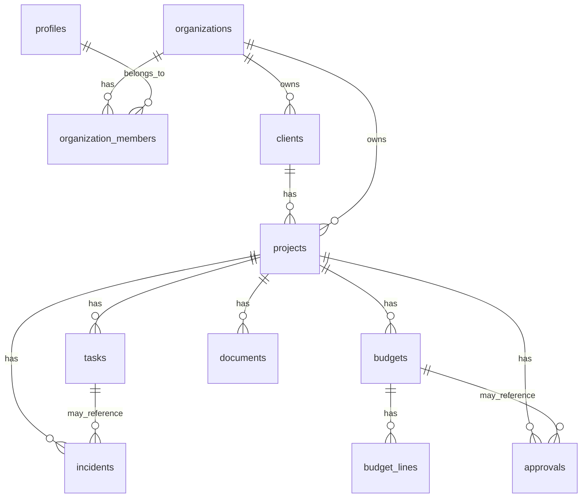

# Supabase MVP Schema

## Design Principles

- Keep the schema close to current read contracts in `src/lib/types`.
- Model `organization_id` on every business table for tenant isolation.
- Use UUID primary keys.
- Store money as integer cents.
- Store rates as numeric decimals, for example `0.30` for 30%.
- Prefer simple tables over advanced polymorphic abstractions for MVP.
- Defer Odoo, inventory, purchases, chat and notifications.

## Current Repo Contracts To Support

| Contract | File | Required database support |
|---|---|---|
| `DashboardSummary` | `src/lib/types/dashboard.ts` | aggregate counts from `projects`, `tasks`, `budgets`, `approvals`, `incidents` |
| `ProjectCard` | `src/lib/types/project.ts` | `projects` joined with `clients`, task/approval counters |
| `ProjectOverview` | `src/lib/types/project-overview.ts` | `projects`, `clients`, counters and enabled sections |
| `ProjectTaskListItem` | `src/lib/types/project-task.ts` | `tasks` joined optionally with `profiles` |
| `BudgetSummary` | `src/lib/types/budget.ts` | `budgets` |
| `BudgetView` | `src/lib/types/budget-view.ts` | `budgets` plus derived alerts |
| `BudgetLine` / `BudgetDetail` | `src/lib/types/budget-line.ts`, `src/lib/types/budget-detail.ts` | `budget_lines` |

## Entity Relationship Summary

## Tables

### `organizations`

Purpose: company/tenant record. Every business object belongs to one organization.

| Column | Type | Required | Notes |
|---|---:|---:|---|
| `id` | `uuid` | yes | primary key |
| `name` | `text` | yes | display name |
| `slug` | `text` | yes | unique stable identifier |
| `created_at` | `timestamptz` | yes | default `now()` |
| `updated_at` | `timestamptz` | yes | default `now()` |

Indexes:

- unique `slug`.

Screens:

- indirectly all product screens through tenant scope.

Current type relation:

- not represented directly today; needed before replacing mocks.

### `profiles`

Purpose: public application profile for an authenticated Supabase user.

| Column | Type | Required | Notes |
|---|---:|---:|---|
| `id` | `uuid` | yes | primary key, references `auth.users(id)` |
| `display_name` | `text` | yes | visible assignee/member name |
| `email` | `text` | no | denormalized for display/search |
| `phone` | `text` | no | optional MVP field |
| `created_at` | `timestamptz` | yes | default `now()` |
| `updated_at` | `timestamptz` | yes | default `now()` |

Indexes:

- lower email index can be added later if needed.

Screens:

- project tasks assignee display.
- future team/settings screens.

Current type relation:

- `ProjectTaskListItem.assigneeName`.

### `organization_members`

Purpose: membership and role mapping between users and organizations.

| Column | Type | Required | Notes |
|---|---:|---:|---|
| `id` | `uuid` | yes | primary key |
| `organization_id` | `uuid` | yes | references `organizations(id)` |
| `profile_id` | `uuid` | yes | references `profiles(id)` |
| `role` | `text` | yes | `owner`, `admin`, `project_manager`, `worker`, `client` |
| `status` | `text` | yes | `active`, `invited`, `disabled` |
| `created_at` | `timestamptz` | yes | default `now()` |
| `updated_at` | `timestamptz` | yes | default `now()` |

Indexes:

- unique `(organization_id, profile_id)`.
- `(profile_id, status)`.
- `(organization_id, role)`.

Screens:

- all authenticated screens through access control.
- future worker/client portals.

Current type relation:

- no direct type today; required for RLS.

### `clients`

Purpose: client/customer linked to an organization and projects.

| Column | Type | Required | Notes |
|---|---:|---:|---|
| `id` | `uuid` | yes | primary key |
| `organization_id` | `uuid` | yes | tenant scope |
| `display_name` | `text` | yes | current `clientName` source |
| `email` | `text` | no | client contact |
| `phone` | `text` | no | client contact |
| `tax_id` | `text` | no | future Odoo/accounting bridge |
| `billing_address` | `text` | no | fiscal address |
| `created_at` | `timestamptz` | yes | default `now()` |
| `updated_at` | `timestamptz` | yes | default `now()` |

Indexes:

- `(organization_id, display_name)`.
- `(organization_id, email)`.

Screens:

- `/projects`
- `/projects/[id]`
- dashboard active project cards.

Current type relation:

- `ProjectCard.clientName`
- `ProjectOverview.clientName`

### `projects`

Purpose: obra/reform project. This is the central product entity.

| Column | Type | Required | Notes |
|---|---:|---:|---|
| `id` | `uuid` | yes | primary key |
| `organization_id` | `uuid` | yes | tenant scope |
| `client_id` | `uuid` | yes | references `clients(id)` |
| `name` | `text` | yes | project/obra name |
| `status` | `text` | yes | repo `ProjectStatus` values |
| `address` | `text` | no | execution address |
| `project_type` | `text` | no | e.g. integral, bathroom, kitchen |
| `start_date` | `date` | no | planned start |
| `end_date` | `date` | no | planned end |
| `responsible_profile_id` | `uuid` | no | references `profiles(id)` |
| `created_at` | `timestamptz` | yes | default `now()` |
| `updated_at` | `timestamptz` | yes | default `now()` |

Indexes:

- `(organization_id, status)`.
- `(organization_id, client_id)`.
- `(organization_id, updated_at desc)`.

Screens:

- `/`
- `/projects`
- `/projects/[id]`
- `/projects/[id]/tasks`
- `/budgets`
- `/budgets/[id]`

Current type relation:

- `ProjectCard.id`, `name`, `status`
- `ProjectOverview.id`, `name`, `status`
- `BudgetSummary.projectId`

### `tasks`

Purpose: project/obra task list with operational state and basic assignment.

| Column | Type | Required | Notes |
|---|---:|---:|---|
| `id` | `uuid` | yes | primary key |
| `organization_id` | `uuid` | yes | tenant scope |
| `project_id` | `uuid` | yes | references `projects(id)` |
| `title` | `text` | yes | task title |
| `description` | `text` | no | optional detail |
| `status` | `text` | yes | repo `TaskStatus` values |
| `priority` | `text` | yes | repo `TaskPriority` values |
| `assignee_profile_id` | `uuid` | no | references `profiles(id)` |
| `assignee_name_snapshot` | `text` | no | MVP display fallback |
| `due_date` | `date` | no | target date |
| `blocked_reason` | `text` | no | reason displayed in current UI |
| `section_label` | `text` | no | current task phase/section display |
| `created_at` | `timestamptz` | yes | default `now()` |
| `updated_at` | `timestamptz` | yes | default `now()` |

Indexes:

- `(organization_id, project_id)`.
- `(organization_id, status)`.
- `(organization_id, due_date)`.
- `(project_id, status, due_date)`.

Screens:

- `/`
- `/projects`
- `/projects/[id]`
- `/projects/[id]/tasks`

Current type relation:

- `ProjectTaskListItem.*`
- dashboard delayed/blocked counters.

### `budgets`

Purpose: presupuesto header and economic summary for a project.

| Column | Type | Required | Notes |
|---|---:|---:|---|
| `id` | `uuid` | yes | primary key |
| `organization_id` | `uuid` | yes | tenant scope |
| `project_id` | `uuid` | yes | references `projects(id)` |
| `title` | `text` | yes | budget display title |
| `code` | `text` | no | human reference |
| `status` | `text` | yes | repo `BudgetStatus` values |
| `currency` | `text` | yes | default `EUR` |
| `surface_square_meters` | `numeric(12,2)` | no | supports €/m2 |
| `estimated_cost_cents` | `integer` | yes | internal cost |
| `sale_price_cents` | `integer` | yes | sold price |
| `target_margin_rate` | `numeric(7,4)` | yes | target margin |
| `actual_margin_rate` | `numeric(7,4)` | yes | current margin |
| `contingency_amount_cents` | `integer` | yes | contingency |
| `client_visible_total_cents` | `integer` | yes | client total |
| `sent_at` | `timestamptz` | no | budget sent date |
| `approved_at` | `timestamptz` | no | budget approval date |
| `created_at` | `timestamptz` | yes | default `now()` |
| `updated_at` | `timestamptz` | yes | default `now()` |

Indexes:

- `(organization_id, project_id)`.
- `(organization_id, status)`.
- unique `(organization_id, code)` where `code is not null`.

Screens:

- `/`
- `/budgets`
- `/budgets/[id]`
- future `/projects/[id]` budget section.

Current type relation:

- `BudgetSummary.*`
- `BudgetView.*`
- `BudgetDetail.*`

### `budget_lines`

Purpose: partidas/line items for a budget.

| Column | Type | Required | Notes |
|---|---:|---:|---|
| `id` | `uuid` | yes | primary key |
| `organization_id` | `uuid` | yes | tenant scope |
| `budget_id` | `uuid` | yes | references `budgets(id)` |
| `chapter_id` | `uuid` | no | deferred; no `chapters` table in MVP |
| `code` | `text` | no | line code |
| `name` | `text` | yes | line name |
| `description` | `text` | no | line detail |
| `kind` | `text` | yes | `material`, `labor`, `subcontract`, `equipment`, `other` |
| `quantity` | `numeric(12,3)` | yes | line quantity |
| `unit` | `text` | yes | e.g. `m2`, `ud`, `h` |
| `unit_cost_cents` | `integer` | yes | internal unit cost |
| `waste_rate` | `numeric(7,4)` | no | mermas |
| `subtotal_cost_cents` | `integer` | yes | internal subtotal |
| `margin_rate` | `numeric(7,4)` | no | line margin |
| `sale_price_cents` | `integer` | yes | line sale price |
| `client_visible` | `boolean` | yes | default true |
| `sort_order` | `integer` | yes | stable display order |
| `created_at` | `timestamptz` | yes | default `now()` |
| `updated_at` | `timestamptz` | yes | default `now()` |

Indexes:

- `(organization_id, budget_id, sort_order)`.
- `(budget_id)`.

Screens:

- future budget detail/editor.
- later `/budgets/[id]` if expanded from summary to full line view.

Current type relation:

- `BudgetLine`.
- `BudgetDetail.lines`.

### `approvals`

Purpose: basic record of approvals requested from a client or internal user.

| Column | Type | Required | Notes |
|---|---:|---:|---|
| `id` | `uuid` | yes | primary key |
| `organization_id` | `uuid` | yes | tenant scope |
| `project_id` | `uuid` | yes | references `projects(id)` |
| `budget_id` | `uuid` | no | optional budget relation |
| `task_id` | `uuid` | no | optional task relation |
| `requested_by_profile_id` | `uuid` | no | references `profiles(id)` |
| `requested_to_profile_id` | `uuid` | no | references `profiles(id)` |
| `kind` | `text` | yes | `budget`, `extra`, `material_change`, `deadline_change`, `phase_delivery`, `other` |
| `status` | `text` | yes | `pending`, `approved`, `rejected`, `cancelled` |
| `title` | `text` | yes | display title |
| `description` | `text` | no | approval details |
| `decided_at` | `timestamptz` | no | decision timestamp |
| `created_at` | `timestamptz` | yes | default `now()` |
| `updated_at` | `timestamptz` | yes | default `now()` |

Indexes:

- `(organization_id, project_id, status)`.
- `(organization_id, status)`.
- `(budget_id)` where `budget_id is not null`.

Screens:

- `/`
- `/projects`
- `/projects/[id]`
- future client portal.

Current type relation:

- `ProjectCard.pendingApprovalsCount`
- `ProjectOverview.pendingApprovalsCount`
- `DashboardSummary.pendingApprovalsCount`

### `incidents`

Purpose: operational issue/alert linked to a project and optionally a task.

| Column | Type | Required | Notes |
|---|---:|---:|---|
| `id` | `uuid` | yes | primary key |
| `organization_id` | `uuid` | yes | tenant scope |
| `project_id` | `uuid` | yes | references `projects(id)` |
| `task_id` | `uuid` | no | references `tasks(id)` |
| `reported_by_profile_id` | `uuid` | no | references `profiles(id)` |
| `level` | `text` | yes | `info`, `warning`, `danger` |
| `status` | `text` | yes | `open`, `resolved`, `cancelled` |
| `title` | `text` | yes | alert title |
| `description` | `text` | no | detail |
| `created_at` | `timestamptz` | yes | default `now()` |
| `updated_at` | `timestamptz` | yes | default `now()` |

Indexes:

- `(organization_id, project_id, status)`.
- `(organization_id, status, level)`.
- `(task_id)` where `task_id is not null`.

Screens:

- `/`
- `/projects/[id]`
- future incident screen.

Current type relation:

- `OperationalAlert`
- `DashboardSummary.operationalAlerts`
- `ProjectOverview.openIncidentsCount`

### `documents`

Purpose: minimal metadata for project documents/photos. Actual file storage is deferred to Supabase Storage.

| Column | Type | Required | Notes |
|---|---:|---:|---|
| `id` | `uuid` | yes | primary key |
| `organization_id` | `uuid` | yes | tenant scope |
| `project_id` | `uuid` | yes | references `projects(id)` |
| `task_id` | `uuid` | no | references `tasks(id)` |
| `uploaded_by_profile_id` | `uuid` | no | references `profiles(id)` |
| `kind` | `text` | yes | `photo`, `document`, `contract`, `invoice`, `other` |
| `title` | `text` | yes | display title |
| `storage_bucket` | `text` | no | future bucket |
| `storage_path` | `text` | no | future object path |
| `mime_type` | `text` | no | optional |
| `size_bytes` | `integer` | no | optional |
| `visible_to_client` | `boolean` | yes | default false |
| `created_at` | `timestamptz` | yes | default `now()` |
| `updated_at` | `timestamptz` | yes | default `now()` |

Indexes:

- `(organization_id, project_id, created_at desc)`.
- `(task_id)` where `task_id is not null`.
- `(project_id, visible_to_client)`.

Screens:

- `/projects/[id]` documents section availability.
- future gallery/documents routes.

Current type relation:

- `ProjectOverview.availableSections`.

## Deferred Tables

These are intentionally not included in the MVP migration:

- `materials`
- `material_requests`
- `purchase_requests`
- `purchase_orders`
- `comments`
- `messages`
- `notifications`
- `time_entries`
- `odoo_sync_links`
- `audit_events`

They should be added only after the first persistent project/task/budget workflow is stable.
